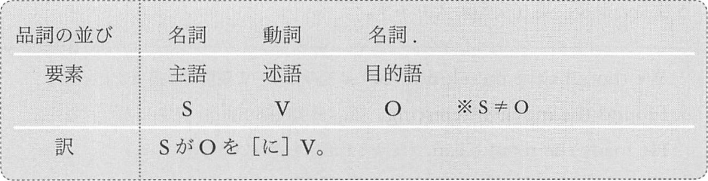
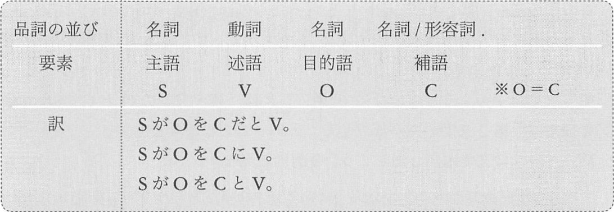
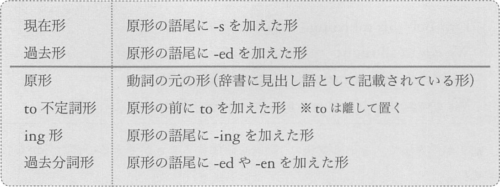

# 基本8文型
## 5文型
### 第1文型 `S V `  
- 主語[_名詞_] + 述語[_動詞_]
- 訳) __S が V。__


```txt
# 例文
Lisa danced.
Meg laughed.
The dog swam.
```

### 第2文型 `S V C` - `※ S = C`
- 主語[_名詞_] + 述語[_動詞_] + 補語[_名詞/形容詞/前置詞句_]
- 訳) __S は C だ。__


```txt
# 例文
My grandfather was pilot.
The lady is a spy.
I was beautiful.
You are honest.
```

### 第3文型 `S V O` - `※ S ≠ O`
- 主語[_名詞_] + 述語[_動詞_] + 目的語[_名詞_]
- 訳) __S が V を[に] O。__



```txt
# 例文
She knows something.
My wife caught an eel.
I touched a tiger.
We climbed the tree.
```

### 第4文型 `S V O O` - `※ O ≠ O`
- 主語[_名詞_] + 述語[_動詞_] + 目的語[_名詞_] + 目的語[_名詞_]  
- 訳) __S が O<sub>1</sub> に O<sub>2</sub> を V。__


```txt
# 例文
I sent Meg a chair.
My husband gave my son a dagger.
The doctor told me a fact.
Tom passed me a ball.
```

### 第5文型 `S V O C` - `※ O = C`
- 主語[_名詞_] + 述語[_動詞_] + 目的語[_名詞_] + 補語[_名詞/形容詞/前置詞句_]
- 訳) __S が O を C だと V。__
  - 「__思考__」に関するもの。acknowledge, think, believe, consider, find, guiess, reconize, regard...
- 訳) __S が O を C に V。__
  - 「__作為__」に関するもの。make, set, keep, leave
- 訳) __S が O を C と V。__
  - 「__呼称__」に関するもの。call, name, title




```txt
We thought the men kind.
I found the movie interesting.
He made the room clean.
They left the dog alone.
My son named the cat Jack.
We call the singer Julie.
```

## 受動態
能動態を受動態にする手順

1. V の直後の O を S にする
2. V の前に be 動詞を加え、V を過去分詞にする
3. S を 「by ~」として文尾に置く

### 第3文型の受動態 `S be Ved`
- 主語[_名詞_] + 述語[_動詞_] + 述語[_動詞_]
- 訳) S が V される[されている]。


```txt
I was scratched <by the cat>.
John is trusted <by them>.
```

### 第4文型の受動態 `S be Ved O`
- 主語[_名詞_] + 述語[_動詞_] + 述語[_動詞_] + 目的語[_名詞_]
- 訳) S が O を V される


```txt
My son was given a pen <by the poet>.
The boy was told a secret <by Meg>.
```

### 第5文型の受動態 `S be Ved C`
- 主語[_名詞_] + 述語[_動詞_] + 述語[_動詞_] + 補語[_名詞/形容詞/前置詞句_]
- 訳) S が C だと V される
- 訳) S が C に V される
- 訳) S が C と V される


```txt
Bob was thought to be a genius <by Meg>.
Bob was left alone <by them>.
The player is called BIG ONE <by us>.
```

## 補語となる前置詞句
> __前置詞__ は、後ろに名詞を伴い、その名詞とセットで補語 (C) となる

### 第2文型のC
```txt
>> 暗記 <<
この本は女の子のためのものだ。 -> この本は女の子向けだ
私にはお金がない
トムは仕事中だ
君のバッグに日がついた状態だ -> 君のバッグが燃えている
```

```txt
This book is for girls
I am without money.
Tom is at work.
Your bag is on fire.
```

### 第5文型のC
```txt
>> 暗記 <<
トムはその機械を動いている状態にした -> トムはその機械を動かした
彼らはボブを一文無しにした
```

```txt
Tom set the machine is in motion.
They left Bob is without money.
```

### 第5文型の受動態のC
```txt
>> 暗記 <<
ボブは <彼らによって> 一文無しにされた
```

```txt
Bob was left without money <by them>.
```


第2文型には、be動詞が用いられたものと、一般動詞が用いられたものがある。  
一般動詞の「〜である」は、純粋に「〜である」という意味ではなく、次のような意味です。

```txt
1. 話者にとっては〜である
   appear, seem, feel, look, sound
2. 〜である状態のままだ
   keep, lie, remain, stay
3. 〜である状態になる
   become, come, fall, get, grow, go

例文:
The doctor seems poor.
Your excuse sounds odd.
We kept still.
Her death remained a mystery.
My wife become a dentist.
Lisa fell ill.
```

## 修飾語
修飾語となる品詞の一覧
- __形容詞__ - 名詞を修飾する
- __副詞__ - 動詞、形容詞、副詞を修飾する
- __前置詞句__ - 名詞、動詞、形容詞、副詞を修飾する

### 形容詞
形容詞は原則として、前から名詞を修飾します
```
I boutht a cute bird.
A handsome boy approached me.
This is an American song.
```

### 副詞
動詞を修飾する場合、後ろから修飾する場合もあれば、前から修飾する場合もあります。
```
We danced slowly.
My mother sang gracefully.
My wife suddenly pushed me.
We often play chess.
```

形容詞を修飾する副詞
```
You wife is very elegant.
I'm extremely sorry.
```

副詞を修飾する副詞
```
We danced vely slowly.
```

### 前置詞句

名詞を修飾する前置詞句
```
I am a teacher of history.
We read a letter from our father.
The pencil on the desk is mine.
The girl in the room is Liz.
```

動詞を修飾する前置詞句
```
I ran with horses.
My daughter danced on a table.
I hid the book under my desk.
John made this chair for Meg.
This poem was written by Kates.
The car was destroyed with a hammer.
```

形容詞を修飾する前置詞句
```
This question is easy to me.
I am interested in Latin.
We are satisfied with this house.
```

副詞を修飾する前置詞句
```
My cat died early in the morning.
The tiger came near to me.
```

### 特殊な第1文型

```
There is a singer in the room.
There are three books on the desk.
```

## 品詞のまとめ


__前置詞句のはたらき = 形容詞のはたらき + 副詞のはたらき__


## 名詞、動詞、前置詞に関する補足

### 名詞に関する補足
#### 名詞を修飾する名詞
```
Train travel is popular here.
My father is a basketball player.
I'm a Carp fan.
```

#### 「-'s」という形で所有格
```
This is also a teacher' job.
I like Tom's house.
```

#### 動詞修飾語としての名詞
時間、空間、方法、数量などに関する名詞のうち、一部のものは動詞修飾語としてはたらく
ことがあります
```
I met Bob this morning.
We danced all night.
I said that three times.
We opened that box this way.
```

### 動詞に関する補足
#### 助動詞
助動詞は本動詞の前に置かれます。  
助動詞には次の4種類があります

```
1. be 動詞 (be, am, are, is, was, were)
2. have, has, had
3. do, does, did
4. 法助動詞 (will, would, can, could, may, might, should, must)
```
1~3は本動詞でもあります。



##### 助動詞としてのbe動詞
基本形に助動詞のbe動詞が加わると進行形になります。
```
Tom is singing.
My dog is licking Met's face.
```
##### 助動詞 have, has
```
Tom has broken the door.
I have been busy since this morning.
```
現在完了形となった場合、「過去の出来事の結果が、現在にも及んでいる」という意味になり、
「ドアは今も壊れたままだ」「今も忙しい」という意味を含むことになります。

##### 助動詞 do, does, died
基本形にこれらが加わると、直後の動詞は原形になります。  
この do, does, did は後ろの述語を強調します。よって、「とても」「実に」「本当に」など
と訳すことになります。
```
I do like Kushiro.
The man does live in a tree.
The rabbit did fly!
```

##### 法助動詞
- will, would (〜つもりだ、〜だろう、〜する予定だ)
- can, could (〜できる、〜であり得る)
- may, might (〜かもしれない、〜してもよい)
- should （〜べきだ、〜はずだ）
- must (〜しなくてはならない)

法助動詞が加わると直後の動詞は原形になります。
```
We can speak Polish.
You should read this book.
```

#### 前置詞に関する補足
##### 群前置詞
群前置詞とは、複数の語がひとまとまりで、前置詞と同じ機能を果たすものです。
```
We sang in front of the statue.
In addition to good looks, the actor has a beautiful voice.
The dogs escaped out of the room.
My success was due to your advice.
```
群前置詞の後ろに名詞があり、これが群前置詞の目的語です。


助動詞が加わると、直後の動詞が現在系、過去形ではなくなる。

## ここまでの文の名称とここからの変形


