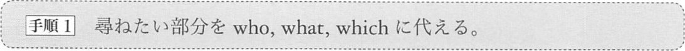
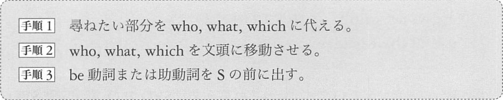
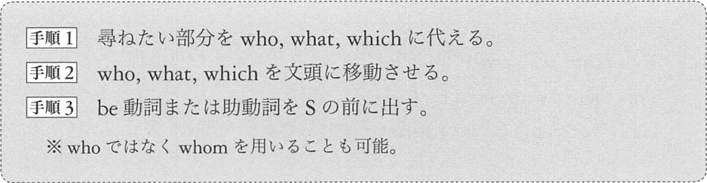
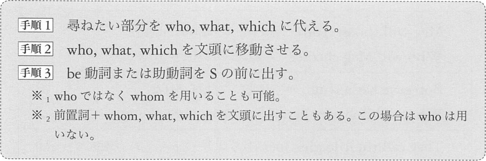
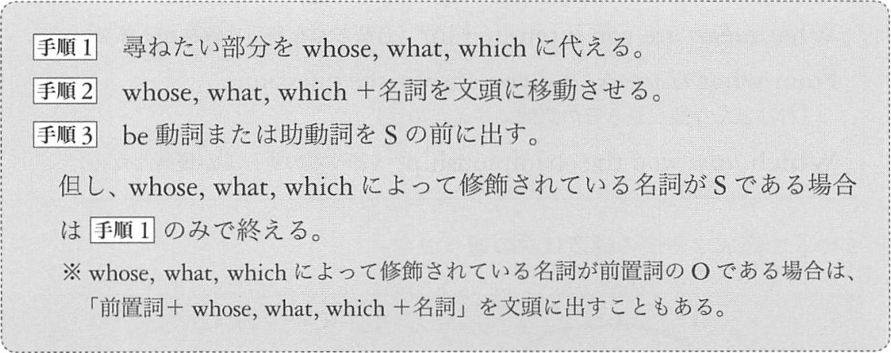
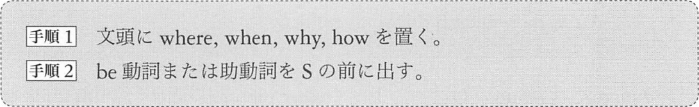
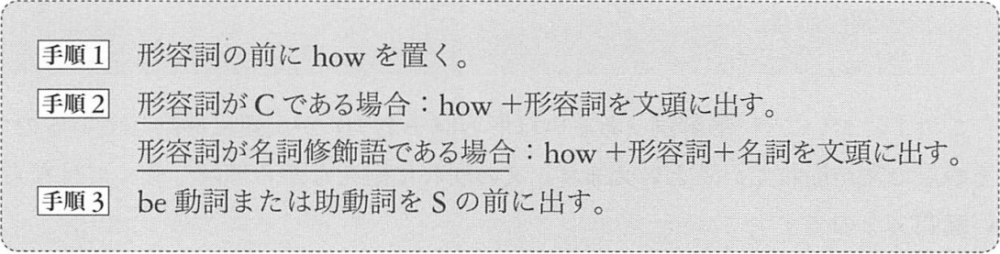
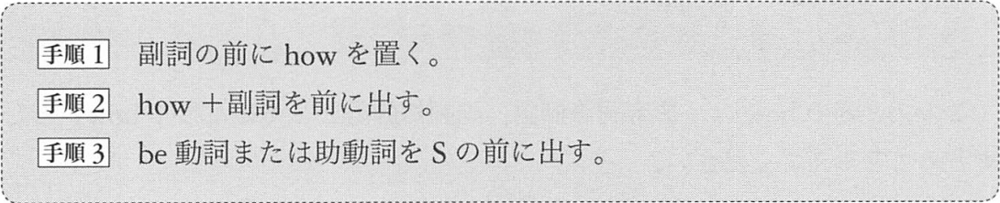
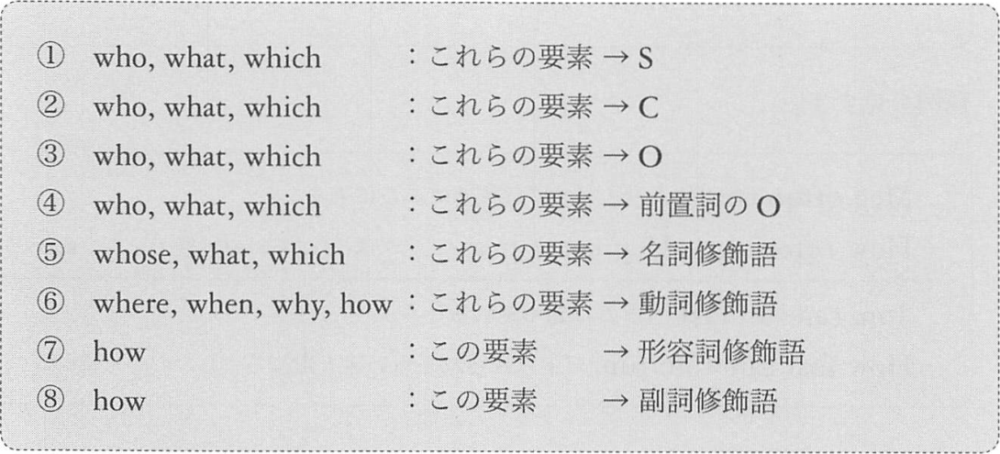
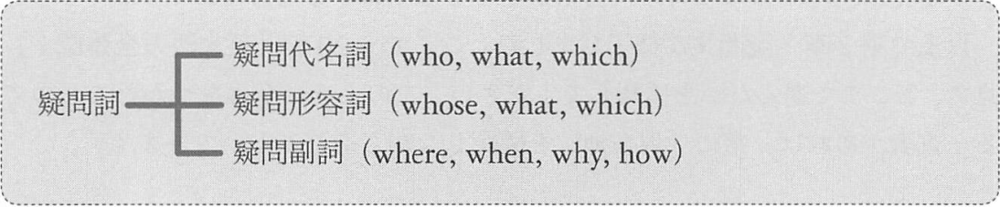

# 疑問文

1. [真偽疑問文](#真偽疑問文)
2. [選択疑問文](#選択疑問文)
3. [疑問詞疑問文](#疑問詞疑問文)

## <a id="真偽疑問文"></a>真偽疑問文

日本語の例
```
あなたは寒がりですか。
皆さんは福知山市に行ったことがありますか。
オーストラリアに砂漠はありますか。
```

英語の真偽疑問文には「yes」「no」で答えます。（ゆえに真偽疑問文は 「yes-no 疑問文」とも呼ばれます）

```text
手順1: be 動詞または助動詞を S の前に出す。
      文の中に be 動詞も助動詞も存在しない場合は、助動詞 do, does, did を加えた形にして、do, does, did を S の前に出す。
```

be 動詞、助動詞の例
```
   Tom's fahther is a singer.
-> Is Tom's father a singer?
(be 動詞を前に出します)

   This insect can fly.
-> Can this insect fly?
(助動詞を前に出します)
```

特殊な第1文型である「there be 動詞 名詞」の例
```
   There is a hat on the safa.
-> Is there a hat on the safa?

   There was a fire here last night.
-> Was there a fire here last night?
```

be動詞も助動詞もない例
```
   Lisa likes Matsuyama.
-> Does Lisa like Matsuyama?

   They live in a car.
-> Do they live in a car?

   Your son wrote the story.
-> Did your son write the story?
```

## <a id="選択疑問文"></a>選択疑問文
選択疑問文とは、自分で答えをいくつか用意し、相手に選んでもらうものです。

日本語の例
```
こちらでお召し上がりになりますか、それともお持ち帰りですか。
王さんは早実時代は野手でしたか、投手でしたか、捕手でしたか。
日本でもっとも魅力的な港町は、函館か横浜か神戸か長崎か。
```

選択疑問文は、真偽疑問文の末尾に「or 〜」が加わった形です。
```
Is a tomato a fruit or a vegetable?
Did you meet Lisa or Meg?
Is he a medical doctor, a dentist or a vet?
```

## <a id="疑問詞疑問文"></a>疑問詞疑問文
日本語の例
```
室町幕府の最後の将軍は誰ですか。
「文民統制」ってなんのことですか。
ピンクレディーのリーダーはどっちだったの。
湘南高校が甲子園で優勝したのはいつですか。
カナブンはどこで採集できますか。
なぜ「ホッキョクグマ」はいるのに「ナンキョクグマ」はいないの。
どうすれば落語家になれますか。
君のボウリングの最高スコアはどれくらいなの。
```

疑問視疑問文とは、「何」「誰」「いつ」「どこで」「なぜ」「どう」「どれくらい」などの、
疑問詞と呼ばれる単語を用いた疑問文です。

1. 平叙文の中で __S__ としてはたらいている部分を尋ねる
2. 平叙文の中で __C__ としてはたらいている部分を尋ねる
3. 平叙文の中で __O__ としてはたらいている部分を尋ねる
4. 平叙文の中で前置詞の __O__ としてはたらいている部分を尋ねる
5. 平叙文の中で名詞修飾語としてはたらいている部分を尋ねる
6. 平叙文で示されている出来事/状態の場所、時、方法、理由を尋ねる
7. 平叙文の中にある形容詞の程度を尋ねる
8. 平叙文の中にある副詞の程度を尋ねる

### 1. 平叙文の中で S としてはたらいている部分を尋ねる



```
   Bob made this chair.
   (Bob を尋ねる)
-> Who made this chair?

   A frog jumped into the pond.
   (A frog を尋ねる)
-> What jumped into the pond?

   Silver is better.
   (Silver を尋ねる)
-> Which is better?
```
who, what, which は S としてはたらきます。

### 2. 平叙文の中で C としてはたらいている部分を尋ねる



```
   This is a radio.
   (a radio を尋ねる)
-> What is this?

   They call the girl Beth.
   (Beth を尋ねる)
-> What do they call the girl?

   Bob's son was named John?
   (John を尋ねる)
-> Who was Bob's son named?
```
who, what, which は C としてはたらきます。

### 3. 平叙文で O としてはたらいている部分を尋ねる



```
   Meg will choose Tom.
   (Tom を尋ねる)
-> Who will Meg choose?
-> Whom will Meg choose?

   Bob gave her a ring.
   (a ring を尋ねる)
-> What did Bob give her?

   They call their leader Joe.
   (their leader を尋ねる)
-> Who do they call Joe?
-> Whom do they call Joe?
```
who, what, which は O としてはたらきます。

### 4. 平叙文の中で前置詞の O としてはたらいている部分を尋ねる



```
   Tom heard the news from Meg.
   (Meg を尋ねる)
-> Who did Tom hear the news from?
-> Whom did Tom hear the news from?
-> From Whom did hear Tom the news?

   This tool was invented by Bob.
   (Bob を尋ねる)
-> Who was this tool invented by?
-> Whom was this tool invented by?
-> By Whom was this tool invented?

   He is working hard for money.
   (money を尋ねる)
-> What is he working hard for?
-> For what is he working hard?
```
文頭の疑問詞は前置詞の O としてはたらきます。

### 5. 平叙文の中で名詞修飾語としてはたらいている部分を尋ねる
疑問視疑問文の中でこれが最難関です。

- Bob likes __this__ _color_.
- This is __Ken's__ _thesis_.
- Meg was praised by __Tom's__ _father_.
- __His__ _mother_ came.

太字の部分の要素は名詞修飾語です。直後の斜体の語を修飾しています。



```text
   Bob likes this color.
   (this) を尋ねる
-> What color does Bob like?

   This is Ken's thesis.
   (Ken's) を尋ねる
-> Whose thesis is this?

   Meg was praised by Tom's father.
   (Tom's) を尋ねる
-> Whose father was Meg praised by?

   His mother come.
   (His) を尋ねる
-> Whose mother come?
```

類例
```
Which university did you choose?
Whose watch is this?
What subject are you interested in?
From what viewpoint did you answer the quesion?
Which team won the championship?
```

文頭の疑問詞は、もちろん名詞修飾語としてはたらきますが、直後の名詞は分の前方にありますが、S とは限りません。
C, O, 前置詞のO の可能性もあります。
「Whose, what, which + 名詞」からはじめある文に出会ったら、その名詞が S, C, O, 前O のいずれなのかを見抜かなくてはならないのです。

### 6. 平叙文でしめされている出来事/状態の場所、時、方法、理由を尋ねる
`Lisa danced.` に関して、次のようなことを尋ねましょう
- _どこで_ リサは踊ったのか。
- _いつ_ リサは踊ったのか。
- _なぜ_ リサは踊ったのか。
- _どのように_ リサは踊ったのか。



文に be 動詞も助動詞も存在しない場合は、助動詞の do, does, did を置きこれを前に出します。

```text
   Tom boutht a sword.
   (どこで) 買ったかを尋ねる
-> Where did Tom buy a sword.

   I can go home.
   (いつ) 家に帰れるかを尋ねる
-> When can i go home?

   Lisa suddenly jumped.
   (なぜ) 跳ねたかを尋ねる
-> Why did Lisa suddenly jump?

   David ran on the water.
   (どうやって) 走ったかを尋ねる
-> How did David run on the water?
```

これらの where, when, why, how の要素は動詞修飾語です。

### 7. 平叙文の中にある形容詞の程度を尋ねる



```
   Meg is Lazy.
-> How lazy is Meg?

   The man has many cars.
-> How many cars does the man have?
```

類例
```
   Lisa was beautiful.
-> How beautiful was Lisa?

   Bob drank much water.
-> How much water did Bob drink?
```

この how は形容詞修飾語としてはたらきます。

### 8. 平叙文の中にある副詞の程度を尋ねる
次のような文の太字部分を尋ねます。
- The lowyer worked __hard__.
- The festival will start __soon__.



```
   The lowyer worked hard.
-> How hard did the lowyer work?

   The festival will start soon.
-> How soon will the festival start?
```

類例
```
   Meg often comes here.
-> How often does Meg come here?

   Tom can run fast.
-> How fast can Tom run?
```

この how は副詞修飾語としてはたらきます。

### 疑問詞疑問文のまとめ





