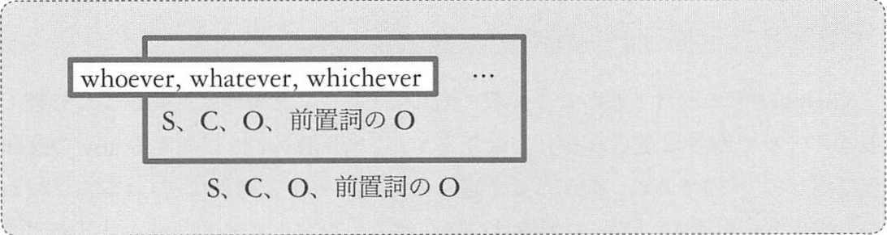
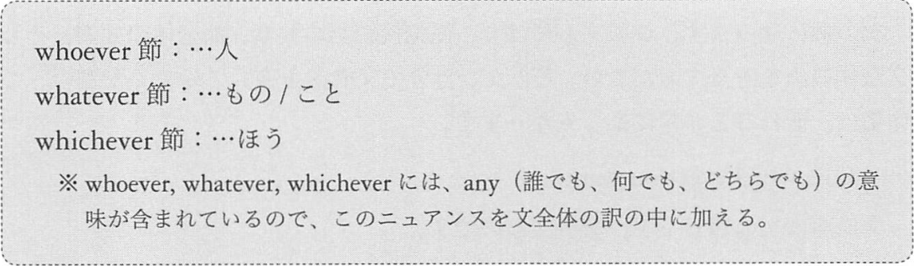
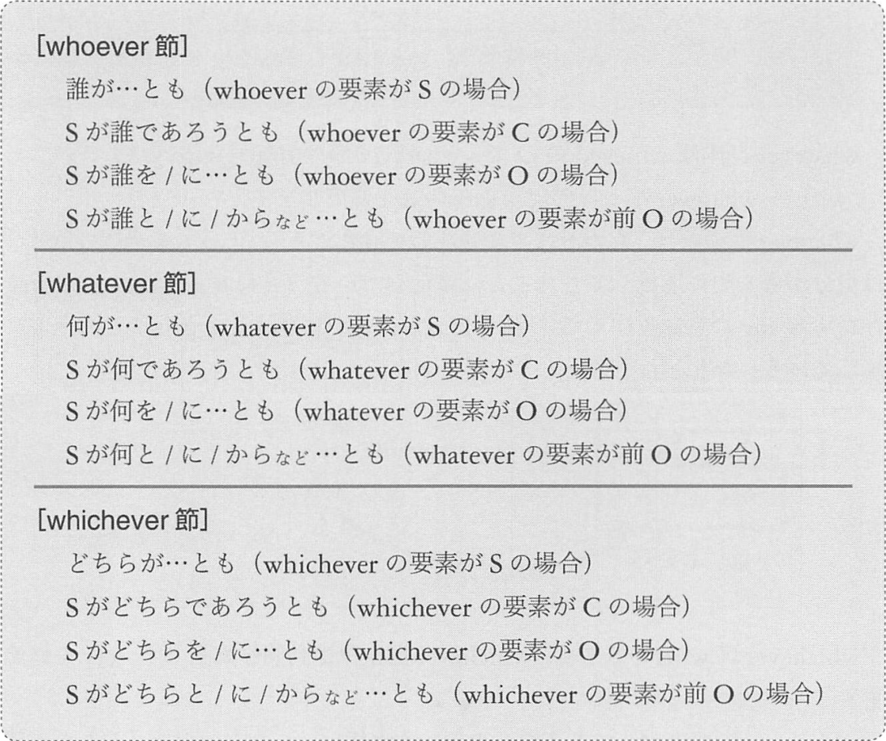
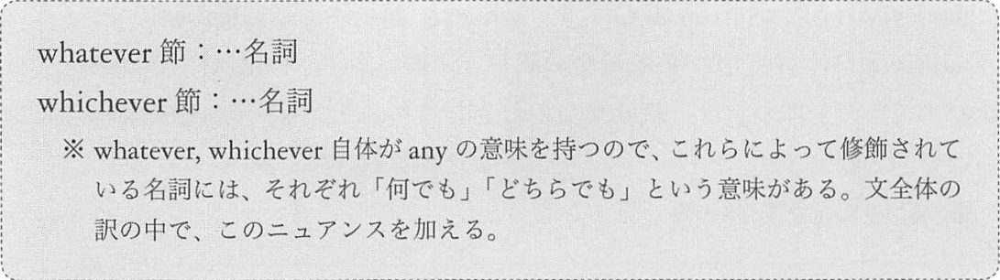
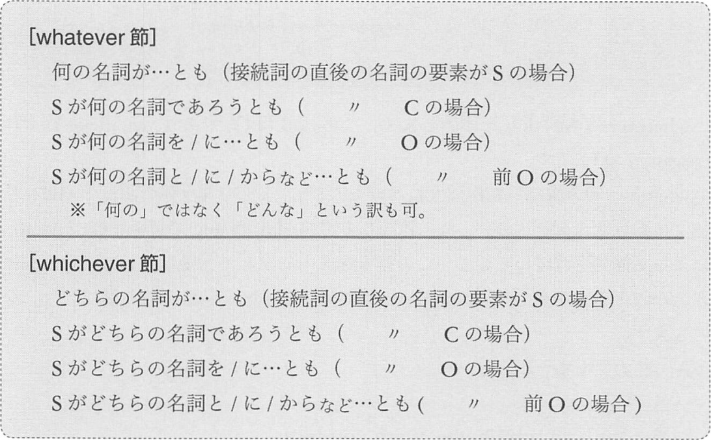

# 従位接続詞の一覧の後半
## <a id="A-1+">A-1'</a> whoever, whatever, whichever





次のことを考えながら例文を読み進めます。
- 従位接続詞自体の要素は何か
- 従属節全体の要素は何か

例: 1
```
Whatever he writes here is sent abroad by e-mail.
O        S  V      動修 be Ved  動修   動修
^^^^^^^^^^^^^^^^^^^^^^^
S
"彼がここに書くもの"

1) 彼がここに書くものはメールで海外に送られる
2) 何であれ、彼がここに書くものはメールで海外に送られる
```

例: 2
```
Take whichever you want.
V    O         S   V
     ^^^^^^^^^^^^^^^^^^
     O
     "君がほしいほう"

1) 君がほしいほうをとりなさい
2) どちらでも君がほしいほうを取りなさい
```

例: 3
```
Whoever touches this stone becomes sick.
S       V       O          V       C
^^^^^^^^^^^^^^^^^^^^^^^^^^
S
"この石に触る人"

1) この石に触る人は病気になる
2) 誰であれ、この石に触る人は病気になる
   この石に触る人は皆、病気になる
```

例: 4
```
I am satisfied with whatever I have achieved until now.
S V  C         前   O        S v    V        ((前  O) = 動詞修飾語)
                    ^^^^^^^^^^^^^^^^^^^^^^^^^^^^^^^^^^
                    O
                    "私が今までに達成してきたこと"
               ^^^^^^^^^^^^^^^^^^^^^^^^^^^^^^^^^^^^^^^
               形容詞修飾語

1) 私は自分が今までに達成してきたことに満足している
2) 私は自分が今までに達成してきたことの全てに満足している
```

例: まとめ
- __Whatever he writes here__ is sent abroad by e-mail.  
  <sup>(彼がここに書くものはすべて、メールで海外に送られる)</sup>
- Take __whichever you want__.  
  <sup>(どちらでも君がほしいほうを取りなさい)</sup>
- __Whoever touches this stone__ becomes sick.  
  <sup>(この石に触る人は皆、病気になる)</sup>
- I am satisfied with __whatever I have archived until now__.  
  <sup>(私は自分が今までに達成してきたことの全てに満足している)</sup>

## <a id="C-1+">C-1'</a> whoever, whatever, whiciever
whoever 節、whatever 節、whichever 節は、動詞修飾語としてもはたらきます。




例: 1
```
Whoever you are, I'll hire you.
C       S   V    S v  V    O
^^^^^^^^^^^^^^^
動詞修飾語

1) 君が誰であろうとも、私は君を雇う
```

例: 2
```
Whichever wins, the players would cry.
S         V     S           v     V
^^^^^^^^^^^^^^
動詞修飾語

1) どちらが勝っても、選手たちは泣くだろう
```

例: 3
```
Whatever you may do, you will succeed.
O        S   v   V   S   v    V
^^^^^^^^^^^^^^^^^^^
動詞修飾語

1) 君は何をしようとも、君は成功するだろう
2) 何をしようとも、君は成功するだろう
```

例: 4
```
Whoever you borrow money from, you must pay it back.
前O     S   V      O     前    S   v     V  O  動修
^^^^^^^^^^^^^^^^^^^^^^^^^^^^^
動詞修飾語

1) 君は誰からお金を借りようとも、それを返さなくてはならない
```

例: まとめ
- __Whoever you are__, I'll _hire_ you.  
  <sup>(君が誰であろうと、私は君を雇う)</sup>
- __Whichever wins__, the players would _cry_.
  <sup>(どちらが勝っても、選手たちは泣くだろう)</sup>
- __Whatever you may do__, you will _succeed_.
  <sup>(何をしようとも、君は成功するだろう)</sup>
- __Whoever you borrow money from__, you must _pay_ it back.
  <sup>(君は誰からお金を借りようとも、それを返さなくてはならない)</sup>

## <a id="A-2+">A-2'</a> whatever, whichever




次のことを考えながら例文を読みます。
- 接続詞によって修飾されている名詞の要素はなにか
- 節全体の要素はなにか

例: 1
```
You can join whichever team you like.
S   v   V    名修      O    S   V
             ^^^^^^^^^^^^^^^^^^^^^^^
             O
             "君が好きなチーム"

1) 君は、君が好きなチームに参加できる
2) 君は、好きなチームのどちらでも参加できる
   どちらでも好きなほうのチームに君は参加できる
```

例: 2
```
My daugther treasured whatever doll I gave her.
S           V         名修     O2   S V    O1
                      ^^^^^^^^^^^^^^^^^^^^^^^^
                      O
                      "私が彼女にあげた人形"

1) 娘は、私が彼女にあげた人形を大事にした
2) 娘は、私が彼女にあげたどんな人形も大事にした
   娘は、私が彼女にあげた人形を全部大事にした
```

例: まとめ
- You can join __whichever tema you like__.
  <sup>(どちらでも好きなほうのチームに参加できる)</sup>
- My dougter treasured __whatever I gave her__.
  <sup>(娘は、私が彼女にあげたどんな人形も大事にした)</sup>

## <a id="C-2+">C-2'</a> whatever, whichever




例: 1
```
Whichever song he may choose, he will sing it well.
名修      O    S  v   V       S  v    V    O  動修
^^^^^^^^^^^^^^^^^^^^^^^^^^^^
動詞修飾語

1) 彼はどちらの歌を選ぼうとも、それを上手に歌えるだろう
```

例: 2
```
Whatever accident may happen, I'll support you.
名修     S        v   V       S v  V       O
^^^^^^^^^^^^^^^^^^^^^^^^^^^^^
動詞修飾語

1) どんな事件が起ころうとも、私はあなたを支えるつもりだ
```

例: 3
```
The noise would annoy you, whichever room you work in.
    S     v     V     O    名修      前O  S   V    前
                           ^^^^^^^^^^^^^^^^^^^^^^^^^^^
                           動詞修飾語

1) 君がどちらの部屋で働こうとも、その騒音が君を悩ませるだろう
```

例: まとめ
- __Whichever song he may choose__, he will _sing_ it well.
  <sup>(彼はどちらの歌を選ぼうとも、それを上手に歌うだろう)</sup>
- __Whatever accident may happen__, I'll _support_ you.
  <sup>(どんな事件が起ころうとも、私はあなたを支えるつもりだ)</sup>
- The noise would annoy you, __whichever room you work in__.
  <sup>(君がどちらの部屋で働こうとも、その騒音が君を悩ませるだろう)</sup>

