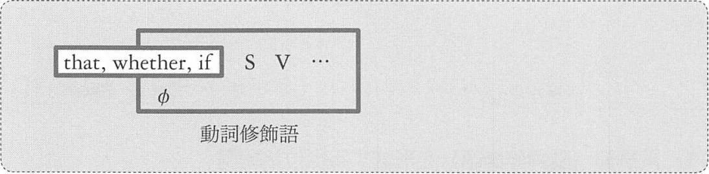
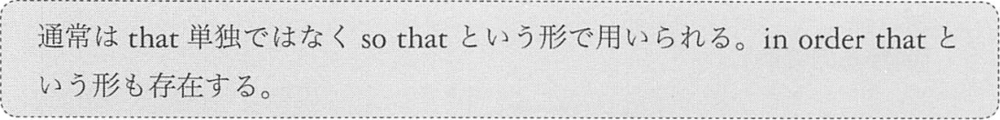
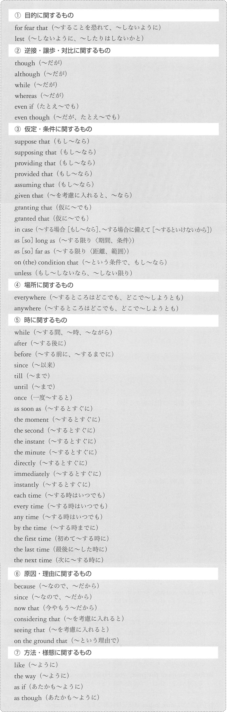

# 副詞節 (動詞修飾語) を形成する従位接続詞
形容詞節は必ず後ろから名詞を修飾しましたが、副詞節は前後のいずれからも動詞を修飾します。

## <a id="C-0">C-0</a> that, wether, if

### that 節
C-0 の that の訳は「~のために」「~のように」です。「目的」の意味を持ちます。

例:
- He _works_ hard every day __so that he can support his family__.  
  (彼は家族を養えるように毎日、懸命に働く)
- I _talked_ to him about some good points about France __so that he would study French__.  
  (彼がフランス語を勉強するように、私はフランスに関するいくつかの良い点について彼に語った)
- We must _do_ our best __in order that we may successd__.  
  (我々は成功するために最善を尽くさなねばならぬ)

### whether 節
この whether 節においてあ、内側に「A or B」という表現があり、
これを受けて whether 節の訳は「AだろうとBだろうと」となります。

例:
- __Whether you stay here or go home__, the result will _be_ the same.  
  (君がここにいようと帰宅しようと、結果は同じだろう)
- You should _do_ the job, __whether you like it or not__.  
  (君がすきだろうがそうでなかろうが、君はその仕事をすべきだ)

### if 節
この if の訳は「もし~なら」です

例:
- __If you don't wear a coat__, you will _catch_ cold.  
  (コートを着ないと風邪をひいちゃうよ)
- __If you are tired__, you should _have_ a rest.  
  (疲れているなら休むべきだ)
- _Come_ __if you like__.  
  (お望みならいらっしゃい)

## <a id="C-3">C-3</a> where, when, how
それぞれの接続詞の訳は次の通りです
- where: ~場所で[に]、~ところで[に]
- when: ~時に
- how: ~方法で

例:
- _Take_ us __Where we can see birds__
  (我々を鳥が見られる場所に連れて行ってください)
- __Where there is whispering__, there _is_ lying.
  (ささやきのあるところには、嘘がある)
- __When I was a child__, I __liked_ cats.
  (子どもの時、僕は猫が好きだった)
- __When you called me__, I was _playing_ with a rabbit.
  (君が電話をくれた時、僕はうさぎと遊んでいた)
- You can _eat_ this __how you like__.
  (あなたの好きな方法でこれを食べてよい)

## <a id="C-5">C-5</a> その他、約50個
このC-5の従位接続詞は、「従位接続詞自体の要素については考える必要のないもの」です。
「動詞修飾語としてはたらく節を形成する」とういことを知り、訳を覚えさえすればいいものなのです。

例: (1) 目的に関するもの
- He _walked_ slowly __for fear that he would wake the baby__.
  (赤ちゃんを起こさないように、彼はゆっくりと歩いた)

例: (2) 逆接・譲歩・対比に関するもの
- __Though I'm poor__, I am happy.
  (貧乏ですが幸せです)
- _Even if you don't help me__, I can _complete_ the job.
  (たとえ君が手伝ってくれなくても、僕はその仕事をやり遂げられる)

例: (3) 仮定・条件に関するもの
- __As long as I live__, I'll _help_ you.
  (僕は生きている限り、君を助けるよ)
- __As far as I know__, Lisa _is_ still single.
  (私の知る限りでは、リサはまだ独身だ)

例: (4) 場所に関するもの
- __Everywhere you go__, you would not _be_ alone.
  (どこに行っても、君はひとりぼっちにはならないだろう)
- __Anywhere you are__, you can _send_ e-mails.
  (どこにいても、君はメールを送れる)

例: (5) 時に関するもの
- __After my hasband went out__, I _called_ Jack.
  (夫が外出した後、私はジャックに電話した)
- __Before you meet the poet__, you should _memorize_ this poem.
  (その詩人に会う前に、この氏を丸暗記するべきだ)

例: (6) 原因・理由に関するもの
- I _cried_ __because I couldn't sing well__.
  (上手に歌えなかったので私は泣いた)
- It would _be_ true, __since Bob says so__.
  (ボブがそう言うのだから、それは本当なのだろう)

例: (7) 方法・様態に関するもの
- _Use_ the pen __like I do__.
  (私がするようにしてそのペンを使いなさい)
- Meg _danced_ __the way I did__.
  (メグは私がしたように踊った)

英語においては多くの語が「複数の品詞である語」なのです

> 英語において、このように同形の語が、いろいろな品詞に容易に転換されることは&lt;略&gt;非常に多い
> この柔軟な品詞の転換は、英語の大きな特徴であり、&lt;略&gt;ほかのヨーロッパ諸国にくらべても、その比類を見ないと言われている

