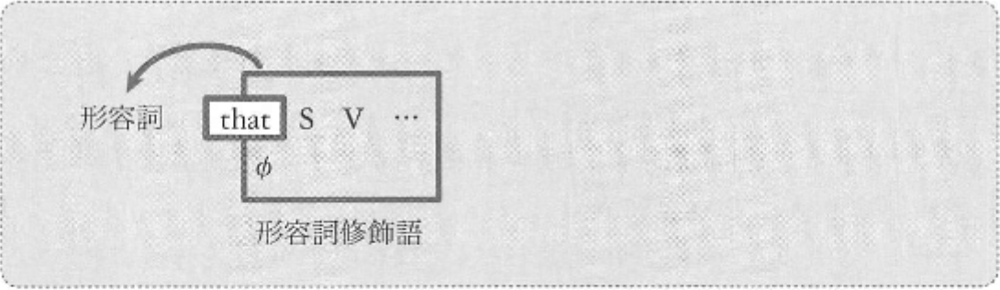

:arrow_left: [従位接続詞](02-chapter-2.md)

# 副詞節 (形容詞修飾語) を形成する従位接続詞
この列の接続詞は、形容詞修飾語としてはたらく節を形成します。  
この列の従位接続詞は that のみです。

節全体は形容詞修飾語として、形容詞を__後ろから__修飾します。  
この that 節によって修飾される形容詞は、次の3種類に分けて捉えます。

1. 感情に関するもの → that 節の訳: ~て、~ので、~ことを
2. 判断に関するもの → that 節の訳: ~とは、~なんて
3. その他 → that 節の訳: ~ことを、~と

例: 1~3の例文を2つずつみます
- I am _satisfied_ __that my son is an accountant__.  
  (私は息子が会計士で満足している)
- We are _glad_ __that our teacher is kind and gentle__.  
  (私たちは自分たちの先生が親切で寛大であることを嬉しく思っている)
- You are _lucky_ __that your parents are singers__.  
  (両親が歌手だなんて君は幸運だ)
- I was _unhappy_ __that my husband was too busy__.  
  (夫が忙しすぎて、私は不幸だった)
- I am _sure_ __that this animal can fly__.  
  (私はこの動物が飛べることを確信している)
- Your letter made me _convinced_ __that I should study chemistry__.  
  (君の手紙は僕に、化学を学ぶべきだと確信させた)

