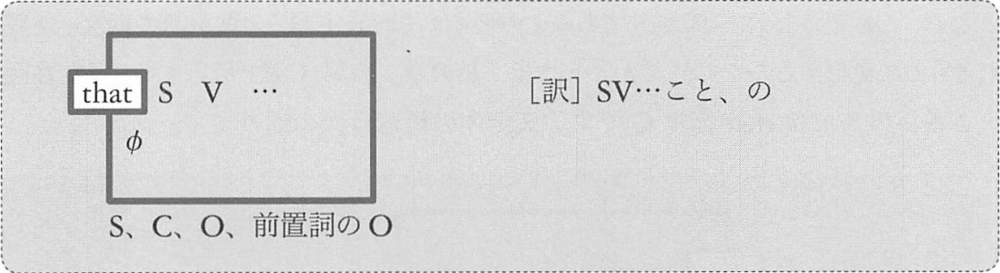

# 従位接続詞
従位接続詞は文の前におかれ、文をひとまとまりの要素にする機能を持ちます。  
「従位接続詞 + 文」でひとまとまりで、SやOや修飾語などの要素にまります。  
このひとまとまりを「節」と言います。


## 1. 名詞節を形成する従位接続詞
### A-0 that, whether, if
#### that 節
that 節はは、S, C, O, 前O のいずれかとしてはたらきます。  
that は「こと」「の」と訳します。



- __That Bob is a doctor__ is widely known.  
  <sup>(ボブが医者だということは広く知られている)</sup>
- My idea is __that we should leave here__.  
  <sup>(私の案は、我々はここをさるべきだということだ)</sup>
- My husband does't know __that I am an actress__.  
  <sup>(夫は私がじゅゆうだということを知らない)</sup>
- Bob told Lisa __that he was sick__.  
  <sup>(ボブはリサに、自分が病気だということを告げた)</sup>
- I like this theory in __that it is beautiful__.  
  <sup>(美しいという点で、私はこの理論が好きだ)</sup>

#### wheter, if
if 節は例外的に「Oとしてしかはたらかない名詞節」です。


- The main question is __whether this incect can fly or not__.  
  <sup>(主な疑問は、この昆虫が飛べるか飛べないかということだ)</sup>
- I don't know __if Meg is happy__.  
  <sup>(私はメグが幸せかどうかわからない)</sup>
- __Whether John lives in Kyoto__ is not certain.  
  <sup>(ジョンが京都に住んでいるかどうか明らかでない)</sup>
- My father often asks me __whether I have enough money__.  
  <sup>(父はよく私に、お金が十分にあるかどうか尋ねる)</sup>
- We talked about __whether we should choose Waseda or Sophia__.  
  <sup>(私たちは早稲田を選ぶべきか上智を選ぶべきかについて話した)</sup>

## A-1~ A-4 の総説
疑問詞は従位接続詞です。

- __疑問詞疑問文において、S の前にある be 動詞/助動詞が、この位置に移動する前の状態に戻せば、疑問詞疑問文は名詞になる__
- __この名詞節では、疑問詞が従位接続詞の役割を果たす__

1. Who is that lady? (疑問詞疑問文)  
   -> That lady is X. (元の平叙文)  
   -> who that lady is (従位接続詞と名詞節)
2. Where did Lisa meet Bob? (疑問詞疑問文)  
   -> Lisa met Bob. (平叙文)
   -> where Lisa met Bob. (従位接続詞と名詞節)

名詞節は、S, C, O, 前Oとしてはたらきます

他の例も見てみましょう
```
   Why can you sing so well? (なぜ君はそんなにうまく歌えるのか)
-> why you can sing so well (なぜ君はそんなにうまく歌えるのかということ)

   How busy is he? (彼はどれくらい忙しいのか)
-> how busy he is (彼はどれくらい忙しいのかということ)

   What do you like? (あなたは何が好きなのですか)
-> what you like (あなたが何を好きなのかということ)

   What does she call you? (彼女は君を何と呼んでいるの)
-> what she call you (彼女が君を何と呼んでいるのかということ)

   Which school did Meg choose? (メグはどっちの学校を選んだの)
-> which school Meg chose (メグがどっちの学校を選んだのかということ)
```

- __疑問詞疑問文を作る段階で、S の前に be 動詞/助動詞を出していない場合は、疑問詞疑問文がそのままで名詞節になる__
- 「S の前に be 動詞/助動詞を出していない場合」は2つあり、「S を尋ねる場合」と「Sの修飾語を尋ねる場合」です

```
   Who wrote the novel? (誰がその小説を書いたのか)
-> who wrote the novel (誰がその小説を書いたのかということ)

   What happened? (なにが起こったのか)
-> what happened (なにが起こったのかということ)
```

## A-1 who, what, which
これらは「疑問代名詞」と呼ばれるものでした。

- I know __what this is__.
  <sup>(私にはこれがなんなのかわかる)</sup>
- __Who painted this picture__ is a mystery.
  <sup>(誰がこの絵を書いたのかは謎だ)</sup>
- I don't know __who Tom heard the news from__.
  <sup>(私はトムが誰から報らせを聞いたのかわからない)</sup>
- Bob doesn't tell me __whom Meg loves__.
  <sup>(ボブは私にメグが誰が好きなのかを教えてくれない)</sup>
