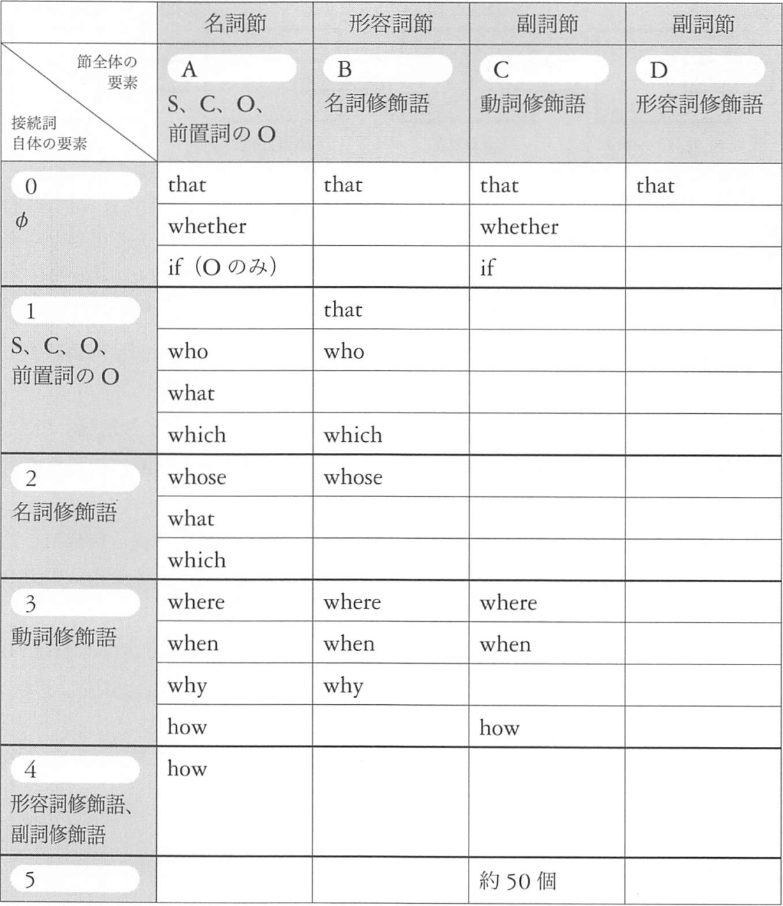
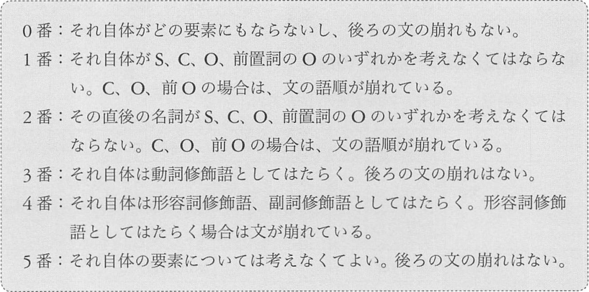
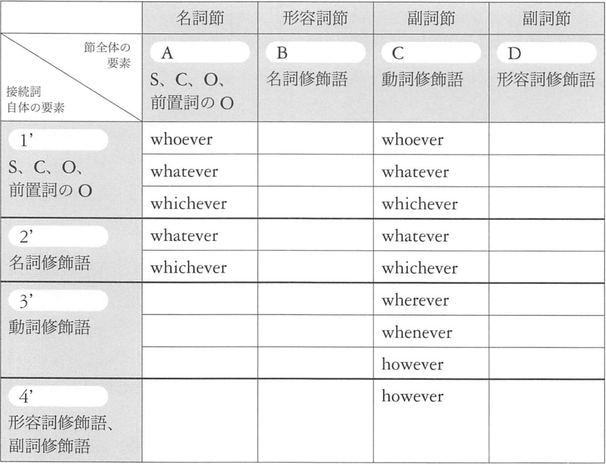
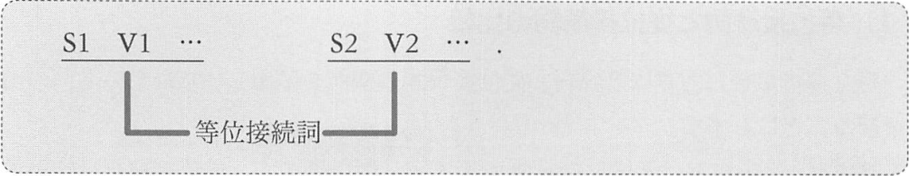
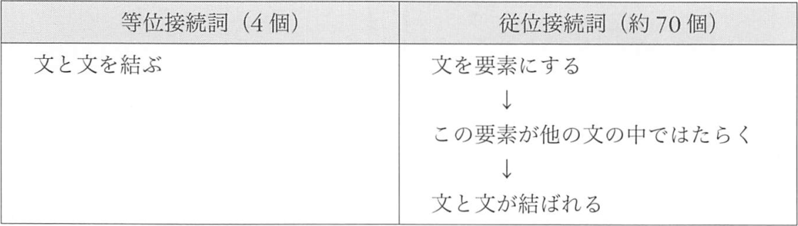

# 従位接続詞
従位接続詞は文の前におかれ、文をひとまとまりの要素にする機能を持ちます。  
「従位接続詞 + 文」でひとまとまりで、SやOや修飾語などの要素にまります。  
このひとまとまりを「節」と言います。

:arrow_forward: <a href="02-chapter-2-A.md#A-0">A-0</a>
<a href="02-chapter-2-A.md#A-1">A-1</a>
<a href="02-chapter-2-A.md#A-2">A-2</a>
<a href="02-chapter-2-A.md#A-3">A-3</a>
<a href="02-chapter-2-A.md#A-4">A-4</a>
A-5  
:arrow_forward: B-0
<a href="02-chapter-2-B.md#B-1">B-1</a>
<a href="02-chapter-2-B.md#B-2">B-2</a>
<a href="02-chapter-2-B.md#B-3">B-3</a>
B-4
B-5  
:arrow_forward: <a href="02-chapter-2-C.md#C-0">C-0</a>
C-1
C-2
<a href="02-chapter-2-C.md#C-3">C-3</a>
C-4
<a href="02-chapter-2-C.md#C-5">C-5</a>  
:arrow_forward: <a href="02-chapter-2-D.md#D-0">D-0</a>
D-1
D-2
D-3
D-4
D-5

## 1. [名詞節を形成する従位接続詞](02-chapter-2-A.md)
## 2. [形容詞節を形成する従位接続詞](02-chapter-2-B.md)
## 3. [副詞節(動詞修飾語)を形成する従位接続詞](02-chapter-2-C.md)
## 4. [副詞節(形容詞修飾語)を形成する従位接続詞](02-chapter-2-D.md)

## 5. [従位接続詞の一覧の後半](02-chapter-2-2.md)

:arrow_forward: <a href="02-chapter-2-2.md#A-1+">A-1'</a>
<a href="02-chapter-2-2.md#A-2+">A-2'</a>  
:arrow_forward: <a href="02-chapter-2-2.md#C-1+">C-1'</a>
<a href="02-chapter-2-2.md#C-2+">C-2'</a>
<a href="02-chapter-2-2.md#C-3+">C-3'</a>
<a href="02-chapter-2-2.md#C-4+">C-4'</a>

## 6. [as](02-chapter-2-as.md)

## 7. 等位接続詞と従位接続詞の比較
従位接続詞は文の前に置かれ、「従位接続詞 + 文」でひとまとまりの要素になるのでした。

上の図の2つの SV のうち、「S1 V1 ...」が「主」で、「従位接続詞 + S2 V2」は「従」なのです。
「S1 V1 ...」の方が、位が上なのです。  
「従位接続詞」の名前は、「主たる SV に対して、従属する位の節を形成する接続詞である」という意味だと考えてください。

この事実に関連させて、2つの用語を覚えてください。  
ここまで「従位接続詞 + SV...」のまとまりを「節」と呼んできましたが、節は節でも、「__従属節__」と呼ばれるものです。
「S1 V1 ...」のほうは「__主節__」と呼ばれます。この2つの SV は__主従関係__にあるのです。

一方、等位接続詞によって文が結ばれた場合は、文と文は__対等__です。

