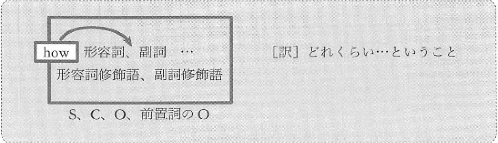
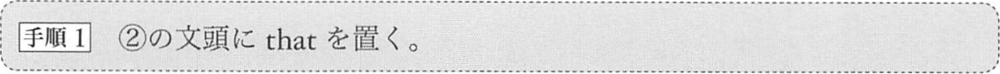
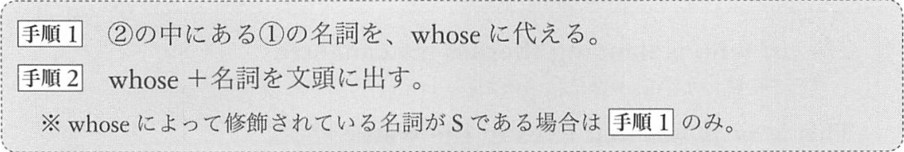
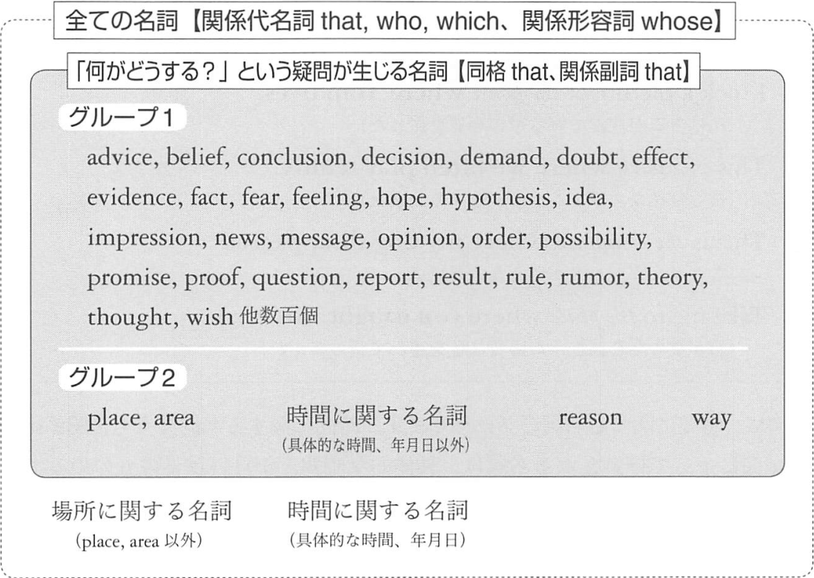

# 従位接続詞
従位接続詞は文の前におかれ、文をひとまとまりの要素にする機能を持ちます。  
「従位接続詞 + 文」でひとまとまりで、SやOや修飾語などの要素にまります。  
このひとまとまりを「節」と言います。


<a href="#A-0">A-0</a>
<a href="#A-1">A-1</a>
<a href="#A-2">A-2</a>
<a href="#A-3">A-3</a>
<a href="#A-4">A-4</a>  
<a href="#B-1">B-1</a>

## 1. 名詞節を形成する従位接続詞
### <a id="A-0"></a>A-0 that, whether, if
#### that 節
that 節はは、S, C, O, 前O のいずれかとしてはたらきます。  
that は「こと」「の」と訳します。


- __That Bob is a doctor__ is widely known.  
  <sup>(ボブが医者だということは広く知られている)</sup>
- My idea is __that we should leave here__.  
  <sup>(私の案は、我々はここをさるべきだということだ)</sup>
- My husband does't know __that I am an actress__.  
  <sup>(夫は私が女優だということを知らない)</sup>
- Bob told Lisa __that he was sick__.  
  <sup>(ボブはリサに、自分が病気だということを告げた)</sup>
- I like this theory in __that it is beautiful__.  
  <sup>(美しいという点で、私はこの理論が好きだ)</sup>

#### wheter, if
if 節は例外的に「Oとしてしかはたらかない名詞節」です。


- The main question is __whether this incect can fly or not__.  
  <sup>(主な疑問は、この昆虫が飛べるか飛べないかということだ)</sup>
- I don't know __if Meg is happy__.  
  <sup>(私はメグが幸せかどうかわからない)</sup>
- __Whether John lives in Kyoto__ is not certain.  
  <sup>(ジョンが京都に住んでいるかどうか明らかでない)</sup>
- My father often asks me __whether I have enough money__.  
  <sup>(父はよく私に、お金が十分にあるかどうか尋ねる)</sup>
- We talked about __whether we should choose Waseda or Sophia__.  
  <sup>(私たちは早稲田を選ぶべきか上智を選ぶべきかについて話した)</sup>

## A-1~ A-4 の総説
疑問詞は従位接続詞です。

- __疑問詞疑問文において、S の前にある be 動詞/助動詞が、この位置に移動する前の状態に戻せば、疑問詞疑問文は名詞になる__
- __この名詞節では、疑問詞が従位接続詞の役割を果たす__

1. Who is that lady? <sup>(疑問詞疑問文)</sup>  
   -> That lady is X. <sup>(元の平叙文)</sup>  
   -> who that lady is <sup>(従位接続詞と名詞節)</sup>
2. Where did Lisa meet Bob? <sup>(疑問詞疑問文)</sup>  
   -> Lisa met Bob. <sup>(平叙文)</sup>  
   -> where Lisa met Bob. <sup>(従位接続詞と名詞節)</sup>

名詞節は、S, C, O, 前Oとしてはたらきます

他の例も見てみましょう
```
   Why can you sing so well? (なぜ君はそんなにうまく歌えるのか)
-> why you can sing so well (なぜ君はそんなにうまく歌えるのかということ)

   How busy is he? (彼はどれくらい忙しいのか)
-> how busy he is (彼はどれくらい忙しいのかということ)

   What do you like? (あなたは何が好きなのですか)
-> what you like (あなたが何を好きなのかということ)

   What does she call you? (彼女は君を何と呼んでいるの)
-> what she call you (彼女が君を何と呼んでいるのかということ)

   Which school did Meg choose? (メグはどっちの学校を選んだの)
-> which school Meg chose (メグがどっちの学校を選んだのかということ)
```

- __疑問詞疑問文を作る段階で、S の前に be 動詞/助動詞を出していない場合は、疑問詞疑問文がそのままで名詞節になる__
- 「S の前に be 動詞/助動詞を出していない場合」は2つあり、「S を尋ねる場合」と「Sの修飾語を尋ねる場合」です

```
   Who wrote the novel? (誰がその小説を書いたのか)
-> who wrote the novel (誰がその小説を書いたのかということ)

   What happened? (なにが起こったのか)
-> what happened (なにが起こったのかということ)
```

### <a id="A-1"></a>A-1 who, what, which
これらは「疑問代名詞」でした。


次のことを考えながら例文を読みます。
- 名詞節全体の要素はS, C, O, 前O のうちのどれか
- 名詞節になる前の疑問文はどのような形か
- 接続詞(疑問詞)自体の要素は S, C, O, 前O のうちのどれか

例文
- I know __what this is__.  
  <sup>(私にはこれがなんなのかわかる)</sup>
- __Who painted this picture__ is a mystery.  
  <sup>(誰がこの絵を書いたのかは謎だ)</sup>
- I don't know __who Tom heard the news from__.  
  <sup>(私はトムが誰から報らせを聞いたのかわからない)</sup>
- Bob doesn't tell me __whom Meg loves__.  
  <sup>(ボブは私にメグが誰が好きなのかを教えてくれない)</sup>

### <a id="A-2"></a>A-2 whose, what, which
これらは「疑問形容詞」でした。
疑問形容詞の直後の名詞は、前方にありながら、Sとは限らず、C, O, 前O の可能性もあります。


次のことを考えながら例文を読みます。
- 名詞節全体の要素は S, C, O, 前O のうちどれか
- 名詞節になる前の疑問文はどのような形か
- 接続詞(疑問詞)によって修飾される名詞の要素は、S, C, O, 前O のちどれか

例文
- Can you imagine __what song this is__?  
  <sup>(これが何のうたなのかを想像できるか)</sup>
- I don't know __which man Lisa chose__.  
  <sup>(私はリサがどちらの男を選んだのかを知らない)</sup>
- My parents are talking about __which chair is better__.  
  <sup>(両親はどちらの椅子がより良いかについて話している)</sup>
- The lady told me __which station we should change train at__.  
  <sup>(その女性は、私たちがどの駅で電車を乗り換えるべきか教えてくれた)</sup>

### <a id="A-3"></a>A-3 where, when, why, how
where, when, why, how は動詞修飾語です。


次のことを考えながら例文を読みます。
- 名詞節全体の要素は何か
- 名詞節になる前の疑問文はどのような形か

例文
- I know __where she lives__.  
  <sup>(私は彼女がどこに住んでいるのかを知っている)</sup>
- The only question is __when the man died__.  
  <sup>(唯一の疑問は、その男がいつ死んだかということだ)</sup>
- My son told me __why he was sitting on the desk__.  
  <sup>(息子は僕に、彼はなぜ自分が机の上に座っているのかを話した)</sup>
- __How they opened the door__ is a riddle.  
  <sup>(どのように彼らがそのドアを開けたのかは謎だ)</sup>

### <a id="A-4"></a>A-4 how
how には「どのように」という意味に加えて、「どれくらい」という意味もあるのでした。
形容詞修飾語、副詞修飾語としてはたらく how です。



次のことを考えながら例文を読みます。
- 名詞節全体の要素
- 名詞節の元の疑問文

例文
- I know __how old Lisa is__.  
  <sup>(私はリサが何歳なのかを知っている)</sup>
- Meg was asked __how fast she can swim__.  
  <sup>(メグはどれくらい速く泳げるかを尋ねられた)</sup>

### A-1 と A-3 の訳語の追加
A-1の what節と、A-3の where節、when節、why節、how節においては、
それぞれ「何」「どこ」「いつ」「なぜ」「どのように」という訳に加えて
もう1つの訳が存在します。

```
A-1: what節 (...もの、...こと)
A-3: where節 (...場所)、when節 (...時)、why節 (...理由)、
     how節(...方法)
```

具体例
- __What Bob said__ was not true.  
  <sup>(ボブが言った__こと__は本当ではなかった)</sup>
- __What caused the fire__ was Lisa's cigarette.  
  <sup>(その火事を引き起こした__もの__はリサのタバコだった)</sup>
- This is __where I caught this bird__.  
  <sup>(ここが僕がこの鳥を捕まえた場所だ)</sup>
- October is  __when rain is unusual in this country__.  
  <sup>(10月はこの国で雨が珍しい時だ)</sup>
- This is __why I like cats__.  
  <sup>(これが私が猫が好きな理由だ)(こういう訳で、私は猫が好きだ)</sup>
- This is __how I found him__.  
  <sup>(これが私が彼を見つけた方法だ)(こんなふうにして、私は彼を見つけた)</sup>

## 2. 形容詞節を形成する従位接続詞
形容詞節は名詞の後ろに置かれます。

英語の形容詞節は、日本語の形容詞節と多くの共通点を持ちます。
よって日本語の形容詞節の知識を出発点にすれば、英語の形容詞節は非常に理解しやすくなります。

以下のような「名詞と分のペア」を用意して、②の文を①の名詞に対する修飾語にする

1. 名詞
2. 文

上のペアにおいては、次の条件を満たした場合に、②の文を①の名詞に対する修飾語にすることができます。

> __①が「何がどうする？」という疑問が生じる名詞である。__

例: タイプXの形容詞節
```
1. 可能性
2. 四国でカワウソが発見される
-> 四国でカワウソが発見される可能性
   ^^^^^^^^^^^^^^^^^^^^^^^^^^ 
   名詞修飾語

1. 通報
2. 札幌駅の前でヒグマが暴れている
-> 札幌駅の前でヒグマが暴れているとの通報
   ^^^^^^^^^^^^^^^^^^^^^^^^^^^^^^
   名詞修飾語

- この道路が陥没する可能性
- タマが僕のピザを食べてしまった証拠
- 上司が頼りにならないという現実
- 息子が将来プロの棋士になるのではないかという予感
- 「本能寺の変」を計画したのは豊富秀吉だという仮説
```

例: タイプYの形容詞
```
1. ハンカチ
2. 彼が私にハンカチをくれた
   > 「ハンカチを」 を消し、1の前に置く
-> 彼が私にくれたハンカチ
   ^^^^^^^^^^^^^^
   名詞修飾語

1. 列車
2. 列車が東へと向かう
   > 「列車が」を消し、1の前に置く
-> 東へと向かう列車
   ^^^^^^^^^^^^

1. ツチノコ
2. 妻が大阪でツチノコを捕まえた
   > 「ツチノコを」を消し、1の前に置く
   妻が大阪で捕まえたツチノコ
   ^^^^^^^^^^^^^^^^^^

1. 藤原道長
2. 藤原道長の日記が国宝に指定されている
   > 「藤原道長の」を消し、1の前に置く
   日記が国宝に指定されている藤原道長
   ^^^^^^^^^^^^^^^^^^^^^^^^^^
```


### <a id="B-0"></a>B-0 that

```
1. the news
2. Meg was arrested.
-> the news that Meg was arrested.
```
news は「何がどうする？」という疑問が生じる名詞です



この that はどの要素にもなりません。  
この B-0 の that は「同格の that」と呼ばれます。

類例
```
1. the rumor
2. John in a gangster.
-> the rumor that John in a gangster.
```

実例: 「名詞 + 同格の that」
- _The news_ __that Meg was arrested__ is shocking to me.  
  <sup>(メグが逮捕されたというニュースは、私には衝撃的だった)</sup>
- Did you hear _the rumor_ __that John is a gangster__?  
  <sup>(ジョンがギャングだという噂を聞いたか)</sup>
- _The fact_ __that the doctor is a writer__ is widely known.  
  <sup>(その医者が作家であるという事実は広く知られている)</sup>
- There is _a possibility_ __that Tom came here last night__.  
  <sup>(トムが昨晩ここに来た可能性がある)</sup>
- His facial expression gave me _the impression_ __that he was speaking the trueth__.  
  <sup>(彼の表情が私に彼は真実を語っているという印象を与えた)</sup>
- We reached _the conclusion_ __that we can't support you__.  
  <sup>(我々は、あなとの援助はできないという結論に達した)</sup>


#### グループ2: place, are
place, area は「何がどうする？」という疑問が生じる名詞です。

例: place
```
1. the place
2. My dog died.
-> tha place that My dog died.
   (僕の犬が死んだ場所)
```
2は1の内容だと言えません。  
よってこの that 節は、同格の that 節とは異質なもので、この that を「__関係副詞の that__」と呼びます。

グループ2: 時間に関する名詞 <sup>(具体的な時間、年月日以外)</sup>
time は、「何がどうする？」という疑問が生じる名詞です。

例: time
```
1. the time
2. Bicycles were rare.
-> the time that bicycles were rare.
   (自転車が珍しかった時)
```
2は1の内容とは言えません。  
この that 節も、同格の that 節とは異質なものなので、この that も関係副詞と呼ばれます。

具体的な時間や年月日以外のものなら、that 節に修飾されます。

例:
```
the day that we can meet Meg.
the night that I became a hero.
the year that Meg lived in Berlin.
```

#### グループ2: reason, way
reason, way も「何がどうする？」という疑問が生じる名詞です。

例: reason, way
```
the reason that Lisa never speaks
the way that my son caught a rat
```

類例: グループ2の名詞を修飾する that 節
```
the area that the deer lives
the moment that I found the treasure
the evening that Meg came here
the reason that I love you
the way that they clean the ship
```

例: 「名詞 + 関係副詞」が文中で使われている例
- Lisa told me _tha place_ __that my dog died.__  
  <sup>(リサは僕に、僕の犬が死んだ場所を教えてくれた)</sup>
- I will talk about _the time_ __that bicycles were here__.  
  <sup>(自転車が珍しかった時についてお話しします)</sup>
- Can you imagine the surprice of _the moment_ __that I found the tresure__?  
  <sup>(私がその宝を見つけた瞬間の驚きを想像できるか)</sup>
- I know _the reason_ __that Lisa never speaks__.  
  <sup>(私はリサが決してしゃべらない理由を知っている)</sup>
- This is _the reason_ __that I love you__.  
  <sup>(これが僕が君を好きな理由だ)</sup>
- _The way_ __that my son caught a rat__ was very creative.  
  <sup>(息子がネズミを捕まえた方法はとても独創的だった)</sup>
- Watch carefully _the way_ __that they clean the ship__.  
  <sup>(彼らがその船を洗う方法を注意深く見なさい)</sup>

これらの that は頻繁に省略される

### B-1 ~ B-2 総説
次の5つに分けて話を進めます。

1. [2 の中において、1 の名詞が S である場合](#B-ptn-1)
2. [2 の中において、1 の名詞が C である場合](#B-ptn-2)
3. [2 の中において、1 の名詞が O である場合](#B-ptn-3)
4. [2 の中において、1 の名詞が前置詞の O である場合](#B-ptn-4)
5. [2 の中において、1 の名詞が名詞修飾語である場合](#B-ptn-5)

このうち、1~4が B-1 に関連し、5が B-2 に関連します

### <a id="B-1"></a>B-1 that, who, which
#### <a id="B-pth-1"></a>1. 2 の中において、1 の名詞が S である場合


例:1
```
1. the animal
2. The animal lives in the water.
       S      V     動詞修飾語

1) that[which] lives in the water

これを1の後ろに置けば、求められる表現となります
-> the animal that lives in the water
              ^^^^^^^^^^^^^^^^^^^^^^^
              名詞修飾語
```

例:2
```
1. the girl
2. The girl is dancing there.
       S    v  V       動詞修飾語

1) who is dancing there.

-> the girl who is dancing there.
            ^^^^^^^^^^^^^^^^^^^^
            名詞修飾語
```

### 2. <a id="B-ptn-2"></a>2 の中において、1 の名詞が C である場合
このケースは稀なので、ここでは扱わず次へ進みます。

### 3. <a id="B-ptn-3"></a>2 の中において、1 の名詞が O である場合


例:
```
1. the machine
2. Bob invented the machine.
   S   V        O

1) Bob invented that[which]
2) that[which] Bob invented

-> the machine that[which] Bob invented
               ^^^^^^^^^^^^^^^^^^^^^^^^
               名詞修飾語
```

例: 第4文型の場合
```
1. the letter
2. I sent Meg the letter
   S  V   O    O

1) I sent Meg that[which]
2) that[which] I sent Meg

-> the letter that[which] I sent Meg
```

例: 第5文型の場合
```
1. the man
2. We call the man Bob.
   S  V    O       C

1) We call who[whom] Bob
2) who[whom] we call Bob

-> the man who[whom] we call Bob
```

### 4. <a id="B-ptn-4"></a> 2 の中において、1 の名詞が前置詞の O である場合


例:
```
1. the forest
2. The bird lives in the forest
   S        V     動詞修飾語

1) The bird lives that[which]
2) that[which] the bird lives in

-> the forest that[which] the bird lives in
              名詞修飾語

前置詞ごと移動する場合
-> the forest in which the bird lives
この場合は that は用いません
```


例:
```
1. the boy
2. Sue threw a ball at the boy
   S   V     O         前O

1) Sue threw a ball at who[whom]
2) who[whom] Sue threw a ball at

-> the boy who[whom] Sue threw a ball at
-> the boy at whom Sue threw a ball
```

ここまでに作った形容詞節は次のようにまとめられます


ここで文法用語を5つ覚えてください
- __これらの従位接続詞は「関係代名詞」と呼ばれる__
- __それ自体が S としてはたらくものは「主格」と呼ばれる__
- __それ自体が O, 前O としてはたらくものは「目的格」と呼ばれる__
- __関係代名詞が形成する節は「関係代名詞節」と呼ばれる__
- __関係代名詞節によって修飾される名詞は「先行詞」と呼ばれる__

例: 「名詞（先行詞） + 関係代名詞節」が文中で使われるようす
- _The girl_ __who is dancing there__ is my daughter.  
  <sup>(そこで踊っている少女は私の娘だ)</sup>
- This is _an animal_ __that lives in the water__.  
  <sup>(これは水の中に住んでいる動物だ)</sup>
- _The machine_ __which Bob invented__ was very beautiful.  
  <sup>(ボブが開発した機械はとても美しかった)</sup>
- Tom read _the letter_ __which I sent Meg__.  
  <sup>(トムは私がメグに送った手紙を読んだ)</sup>
- That is _tha man_ __who we call Bab__.  
  <sup>(あれは私たちがボブと呼んでいる男だ)</sup>
- _The forest_ __that the bird lives in__ is very dangerous.  
  <sup>(その鳥が棲んでいる森はとても危険だ)</sup>
- I know the name of _the boy_ __at whom Sue threw a ball__.  
  <sup>(私はスーがボールを投げつけた少年の名前を知っている)</sup>

## <a id="B-2"></a>B-2 whose
### 5. <a id="B-ptn-5"></a>2 の中において、1 の名詞が名詞修飾語である場合



例:
```
1. the man
2. Meg touched the man's shoulder.

1) Meg touched whose shoulder
2) whose Meg touched shoulder

-> the man whose Meg touched
```

例: 
```
1. the girl
2. The girl's voice is very beautiful.

1) whose voice is very beautiful.

-> the girl whose voice is very beautiful
```

例: 「名詞 + whose 節」が文中で用いられるようす
- _The man_ __whose shoulder Meg touched__ was very tall.
  <sup>(メグが肩を触った男はとても背が高かった)</sup>
- I know _a girl_ __whose voice is very beautiful_.
  <sup>(私は声がとても美しい少女を知っている)</sup>
- I have _a friend_ __whose father is a famouse singer__.
  <sup>(僕には、お父さんがとても有名な歌手である友達がいる)</sup>
- She is _a novelist_ __whose books are widely known__.
  <sup>(彼女はその本が広く読まれている小説家だ)</sup>

whose に関する用語を3つ知ります
- この whose は「関係形容詞」と呼ばれる
- 関係形容詞が形成する節は「関係形容詞節」と呼ばれる
- 関係形容詞によって修飾される名詞は「先行詞」と呼ばれる

最後に次のことを記憶してください
__全ての名詞が関係代名詞、関係形容詞によって修飾される__



### <a id="B-3"></a>B-3 where, when, why
#### where
場所に関する名詞の全てが、where 節によって修飾されます。
(ということは、place と area は、that 節にも where 節にも修飾されることになります)

例: where
- I took a picture of _the house_ __where Tom lives__.  
  <sup>(私はトムが住んでいる家の写真を撮った)</sup>
- This is _a park_ __where we often play tennis__.  
  <sup>(ここは私たちがよくテニスをした公園だ)</sup>
- This is _the mountain_ __where my dog disappeared__.  
  <sup>(ここがうちの犬が消えた山だ)</sup>
- Take me to _the place_ __where you caught this bird__.  
  <sup>(君がこの鳥を捕まえた場所に私を連れて行ってくれ)</sup>

#### when
時間に関する名詞の全てが、 when 節によって修飾されます。
(ということは、具体的な時間、年月日以外のものは、that 節と when 節の両方に修飾されることになります)

例: when
- I lived in Osaka in _1970_ __when the expo was held__.  
  <sup>(その博覧会が開かれた1970年に、私は大阪に住んでいた)</sup>
- That was _an evening_ __when everthyng was shining__.  
  <sup>(それはすべてが輝いていた夕方だった)</sup>
- Sometimes I can't remember _the days_ __when I was young__.  
  <sup>(時々、若かった日々のことを思い出せないことがある)</sup>
- _The time_ __when we were happy__ was very long.  
  <sup>(私たちが幸せだった日々はとても長かった)</sup>

#### why
reason は、関係副詞の that 節によって修飾されるのですが、that ではなく why を用いることもできます。

例: reason が why 節に修飾されている例
- _The reason_ __why my daugther bacame a nun__ is not clear.  
  <sup>(娘が尼さんになった理由は明らかではない)</sup>
- Tell me _the reason_ __why you are so beautiful__.  
  <sup>(君がそんなにきれいなわけを教えてくれ)</sup>

なお、reason と why が連続すると、ややくどう感じになります。
reason の後ろの接続詞は省略されるのが一般的です。
