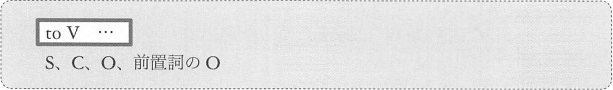
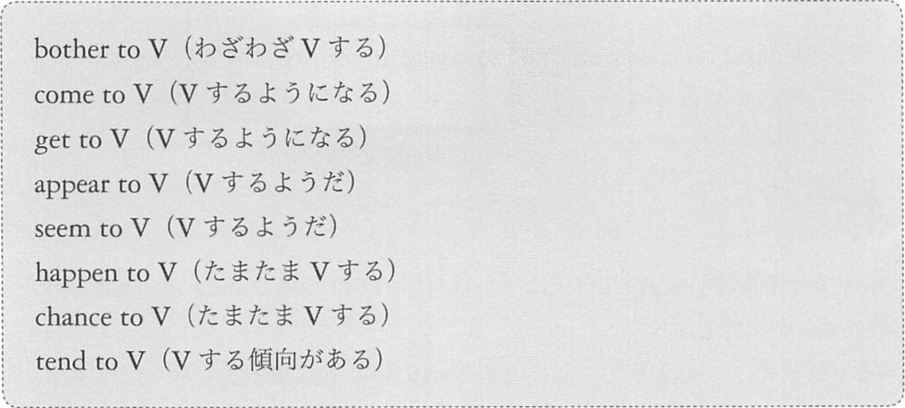
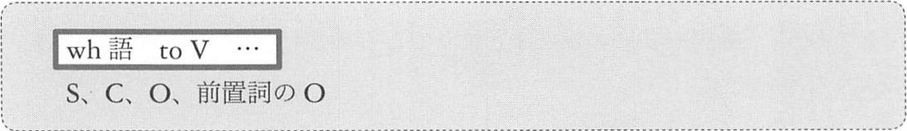
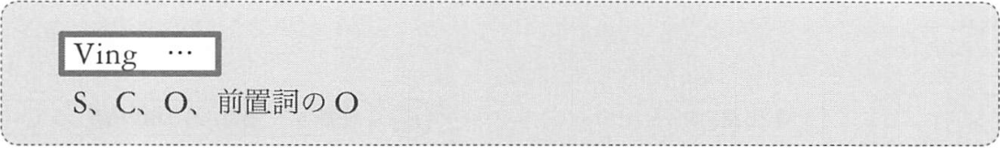

# S, C, O 前置詞の O としてはたらく準動詞句
## <a id="A-1">A-1</a> S, C, O, 前置詞の O としてはたらく toV 句



このような、S, C, O, 前O としてはたらく toV 句は「__名詞的用法__」と呼ばれます。  
こと toV 句は、「~こと「~の」と訳します。

次のことを考えながら英文を読みます。
- それぞれの toV 句が S, C, O, 前O のどれとしてはたらいているか

例:
- __To work here without a helmet__ is dangerous.  
  <sup>(ここでヘルメットなしではたらくのは危険だ)</sup>
- __To protect the environment__ is important.  
  <sup>(環境を保護することは大切だ)</sup>
- Her wish is __to be a singer__.  
  <sup>(彼女の望みは歌手になることだ)</sup>
- My goal is __to win in the Olympics__.  
  <sup>(私の目標はオリンピックで勝つことだ)</sup>
- I have decided __to learn German__.  
  <sup>(私はドイツ語を学ぶことを決意した)</sup>
- They need __to take a rest__.  
  <sup>(彼らは休憩をとることを必要としている → 彼らは休憩をとる必要がある)</sup>
- We had no choice except __to accept his offer__.  
  <sup>(我々には彼の申し出を受け入れる以外の無の選択肢があった → 我々は彼の申し出を受け入れざるを得なかった)</sup>

「動詞 + to」のひとまとまりでとらえるしかない表現もあります。



例: 「動詞 + to」
- At last, we __came to__ understand his theory.  
  <sup>(ついに私たちは彼の理論を理解するようになった)</sup>
- How did you __get to__ own this picture?  
  <sup>(どのようにしてこの絵を所有するようになったのか)</sup>
- My son __appears to__ love animals.  
  <sup>(息子は動物が好きなようだ)</sup>
- The philosopher __seems to__ live in a barrel.  
  <sup>(その哲学者は樽の中に住んでいるようだ)</sup>
- I also __happend to__ be there on Christmas Eve.  
  <sup>(クリスマスイブには、私もたまたまそこにいた)</sup>

```
My son appears to love animals.
S      ^^^^^^^^^^ V    O
       v
```

toV 句の名詞的用法の形として、もう1つ、次のものを知ってください



この表現においては、to という語の中心の意味 (どこかに向かう「→」の意味。具体的には「意思」「義務」「予定」など) が
はっきりと存在します。よって、それを訳に反映させます。

例:
- I wonder __who to invite__.  
  <sup>(誰を招待するべきかということを思う → 誰を招待するべきだろうか)</sup>
- We couldn't decide __whether to go or stay__.  
  <sup>(我々は行くべきか留まるべきか決められなかった)</sup>
- I don't know __how to raise this animal__.  
  <sup>(この動物をどうやって育てるべきかわからない。)</sup>

全て「べき」という訳語で、義務のニュアンスを出しています。

## <a id="A-2">A-2</a> S, C, O, 前置詞のO としてはたらく Ving 句



この Ving 句も「~こと」「~の」という訳になります。
この Ving 句は「動名詞」と呼ばれます。

例:
- __Talking with this bird__ relaxies my mind.  
  <sup>(この鳥としゃべることが私の心を落ち着かせる → この鳥としゃべると心が落ち着く)</sup>
- __Reading in the dark__ dameges your eyes.  
  <sup>(暗いところで読書をすることが目に害を及ぼす → 暗いところで読書すると目が悪くなる)</sup>
- One of my bad habits is __biting pencils__.  
  <sup>(私の悪い癖の1つは鉛筆を噛むことだ)</sup>
- Your only fault is __speaking too fast__.  
  <sup>(君の唯一の欠点は速くしゃべりすぎることだ)</sup>
- My father often enjoys __playing tennis__.  
  <sup>(父はよくテニスをするのを楽しむ)</sup>
- Stop __sleeping in my room__.  
  <sup>(僕の部屋で寝るのはやめてくれ)</sup>
- Before __attacking a horse__, the tiger roared three times.  
  <sup>(馬を攻撃する前に、そのトラは3回吠えた)</sup>
- Meg left me without __saying good-bye__.  
  <sup>(メグはさよならも言わずに僕のもとを去った)</sup>