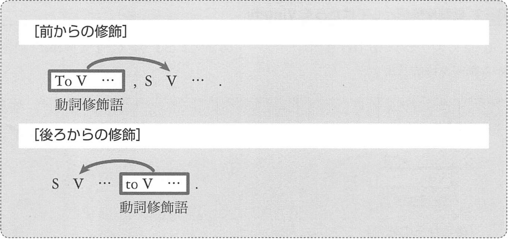
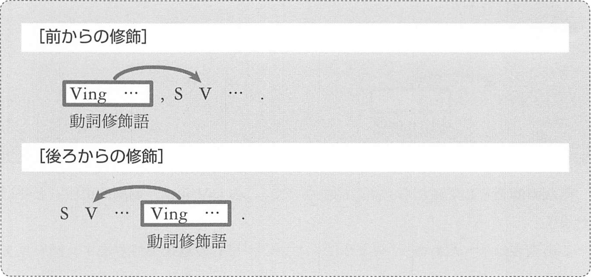
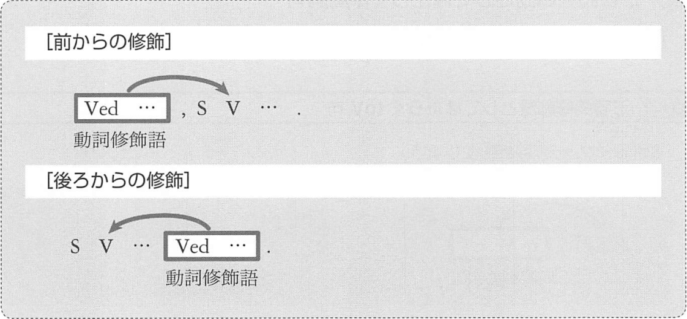

# 動詞修飾語としてはたらく準動詞句
## <a id="C-1">C-1</a> 動詞修飾語としてはたらく toV 句
動詞修飾語としてはたらく副詞節は、前から修飾することも、後ろから修飾することもあるのでした。

動詞修飾語としてはたらく語は副詞なので、この toV 句は「__副詞的用法__」と呼ばれます。  
この表現は、「~のために」「~のように」という、目的の意味を持ちます。

例:
- __To bake delicious cookies__, you must _use_ fresh butter.  
  (おいしいクッキーを焼くためには、新鮮なバターを使わなければいけない)
- My father _stopped_ __to light a cigarette__.  
  (親父はタバコの火をつけるために立ち止まった)

この C-1 においては、 to の前に so as や in order が置かれ、
__so as to V__、__in order to V__ という形で用いられることがあります。

例: so as, in order to
- Bob _worked_ hard __in order to win the contest__.  
  (ボブはそのコンテストに勝つために懸命に働いた)
- _Use_ this microphone __so as to be heard by everybody__.  
  (みんなに聞こえるようにこのマイクを使いなさい)

## <a id="C-2">C-2</a> 動詞修飾語としてはたらく Ving 句

この Ving 句は、「Ving 句の副詞的用法」と呼ぶと理解しやすいのですが、
伝統的には「__分詞構文__」と呼ばれています。  
訳は次の通りです

> て・と・ら・ながら・ので、まま・が

例:
- __Playing succer__, I _hurt_ my ankle.  
  (サッカーをしていて、足首を痛めた)
- __Singing the song__, I always _remember_ my mother.  
  (その歌を歌うと、私はいつも母を思い出す)
- __Climbing this tree__, you can _see_ the port.  
  (この気に登ったら、港が見える)
- __Beeing ill__, I couldn't _go_ to school.  
  (病気だったので、学校に行けなかった)
- Lisa and Bob were _sitting_ on the beach, __looking at the sunset__.  
  (リサとボブは夕焼けを見ながら浜辺に座っていた)

なお、分詞構文は主に書き言葉で用いられるものです。
よって会話で用いる際には as や when, while, if などの従位接続詞、
あるいは and や so などの等位接続詞、等位接続副詞を用いて節で表現したほうが自然な文となります。

## <a id="C-3">C-3</a> 動詞修飾語としてはたらく Ved 句

この Ved 句については、次のことを知ってください
- 受動態の意味（「~される」「~されている」）が存在する
- 分詞構文の一種なので、V につなぐ訳語は [B-2](03-chapter-1-B.md#B-2) の訳語から選ぶ

例:
- __Painted twenty minutes ago__, this bench _is_ still wet.  
  (20分前に塗られたので、このベンチはまだ乾いていない)
- The boy _came_ here __accompanied by his mother__.  
  (その少年は、お母さんに付き添われてここに来た)
- __Given enough time__, I can _do_ the job.  
  (十分な時間が与えられたら、私はその仕事ができる)

:point_right: 例文を暗記!
