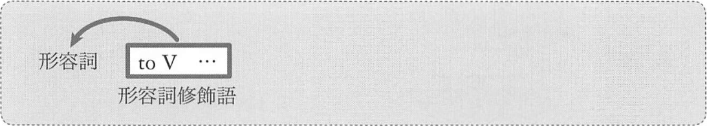
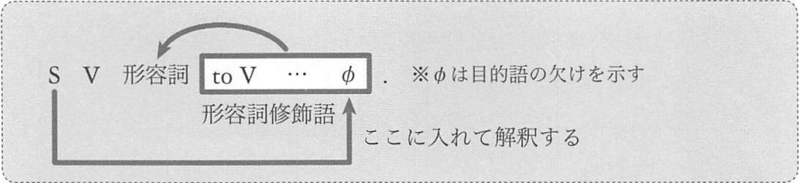
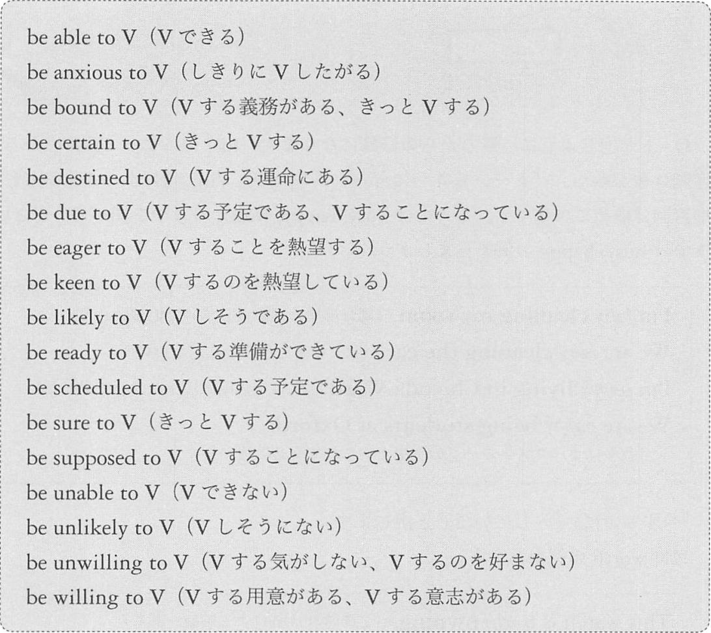
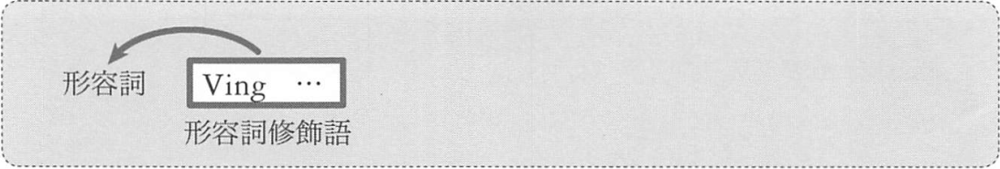

# 形容詞修飾語としてはたらく準動詞句
## <a id="D-1">D-1</a> 形容詞修飾語としてはたらく toV 句



後ろからの修飾となります。
that 節による形容詞修飾と同じです。
形容詞を修飾するのは副詞です。よって、この toV 句は「__副詞的用法__」と呼ばれます。

この用法は次の4パターンに分かれます。  
:point_right: 太字の部分を暗記!

1. 形容詞が_感情_に関するものであり、toV 句がその__感情の原因__を示すもの (訳: ~て、~ので)
2. 形容詞が_判断_に関するものであり、toV 句がその__判断の根拠__を示すもの (訳: ~とは、~なんて)
3. toV 句の内側に__目的語の欠け__があるもの (訳: ~のに、~のが)
4. 「be 形容詞 to」のまとまりでとらえ、これを__成句__として記憶するもの


例: 1 感情に関するもの
- I'm _surprised_ __to see you here__.  
  <sup>(ここであなたに会って驚いている)</sup>
- We are _sorry_ __to hear the news__.  
  <sup>(その知らせを聞き、我々は残念に思います。)</sup>
- Your mother will be _angry_ __to see the score__.  
  <sup>(その点数を見たら君のお母さんは怒るだろう)</sup>

形容詞 suprised, sorry, angry はいずれも感情に関するものです。
そしてこれらの感情が起こった原因を、その後ろの toV 句が示しています。

例: 2 判断に関するもの
- You are _careless_ __to do that__.  
  <sup>(そんなことをするなんて君は不注意だ)</sup>
- You were _wise_ __to reject the offer__.  
  <sup>(その申し出を拒絶したとは君は賢明だった)</sup>
- You must be _crazy_ __to blast my car__.  
  <sup>(僕の車を爆破するなんて君はおかしいに違いない)</sup>

careless, wise, crazy は、いずれも性質、性格を判断している形容詞です。
そしてそのように判断した根拠を、その後ろの toV 句が示しています。

例: 3 「目的語の欠け」の構造
```
This theory is difficult to understand.
(この理論は理解するのが困難だ)
```
形容詞の後ろに toV 句があり、その中に「__目的語の欠け__」があります。
understand の目的語が欠けているのです。
このような構造の文は、次のような読み方が必要になります。



文の主語を欠けている目的語として理解するのです。

例: 3 「目的語の欠け」の類例
- His explanation is _impossible_ __to comprehend__.  
  <sup>(彼の説明は理解するのが不可能だ)</sup>
- Your book is _easy_ __to read__.  
  <sup>(君の本は読むのに易しい → 君の本は読み易い)</sup>
- This house is _comfortable_ __to live in__.  
  <sup>(この家は住むのに快適だ)</sup>
- Tom is _impossible_ __to work with__.  
  <sup>(トムは一緒に働くのが不可能だ)</sup>

comprehend, read, in, with の目的語が欠けています。
文の主語を目的語の位置に補って理解するのです。

例4: 
```
Ken is likely to choose Waseda
(ケンは早稲田を選びそうだ)
```
likely までの文で「ケンはしそうである」と述べ、その後ろの toV 句で何をしそうなのかが示されています。  
toV 句が likely を修飾しているのです。

ただこの文は実質的に次のような構造だと考えることができます。
```
Ken is likely to choose Waseda.
S   V  C      ^^^^^^^^^^^^^^^^
              形容詞修飾語 <likely を修飾>

Ken is likely to choose Waseda.
S   ^^^^^^^^^^^^ V      O
    v
```

Ken choose Waseda を文の骨格だと考え、「is + likely + to」をまとめて
「~しそうである」という意味の助動詞として捉えるのです。



例:
- This baby __is able to__ run fast.  
  <sup>(この赤ちゃんは速く走れる)</sup>
- Bob __is certain to__ come.  
  <sup>(ボブはきっと来る)</sup>
- The project __was destined to_ fail.  
  <sup>(その計画は失敗する運命にある)</sup>
- My wife __is eager to__ meet your wife.  
  <sup>(うちの妻はしきりに君の奥さんに会いたがっている)</sup>
- We __are ready to__ attack.  
  <sup>(我々は攻撃する準備ができている)</sup>
- They __are scheduled to__ visit Canada next month.  
  <sup>(彼らは来月カナダを訪れる予定になっている)</sup>
- I'__m unable to__ play the piano.  
  <sup>(私はピアノを弾くことができない)</sup>

## <a id="D-2">D-2</a> 形容詞修飾語としてはたらく Ving 句



D-1 と同じように後ろから修飾になります。

Ving 句によって修飾される形容詞は極めて少数です。  
ここでは busy, happy, worth の3つを知ってください

例: busy, happy
- I'm _busy_ __cleaning my room__.  
  <sup>(僕は部屋の掃除をしていて忙しいんだ)</sup>
- We are _busy_ __cleaning the car__.  
  <sup>(我々は車を洗うのに忙しいのだ)</sup>
- I'm _happy_ __living in Chiyoda Ward__.  
  <sup>(私は千代田区に住んでいて幸せだ)</sup>
- We are _happy_ __being students at Oxford__.  
  <sup>(我々はオックスフォードの学生でいられて幸せに思います)</sup>

「^するのに」「~していて」と訳します

例: worth
- This watch is _worth_ __owning__.  
  <sup>(この時計は所有する価値がある)</sup>
- His songs are _worth_ __listening to__.  
  <sup>(彼の歌は聴く価値がある)</sup>

動詞 owning の目的語と、前置詞 to の目的語がありません。
主語の this watch と his songs を目的語として解釈します。
つまり「worth + Ving 句」においては次のような読み方必要になるのです。


