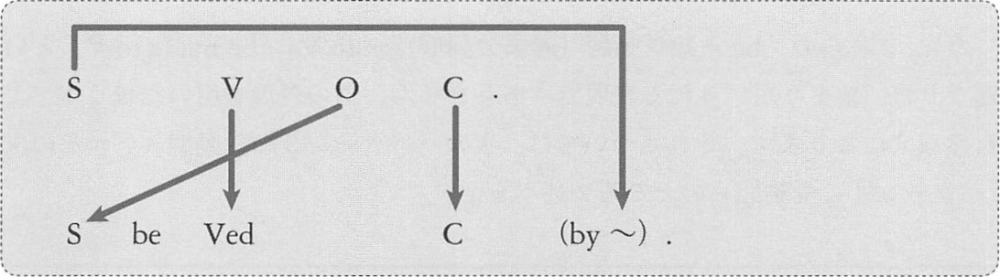

# S be Ved C の C としてはたらく準動詞句



## パターン2 の受動態
例: Lisa saw Tom kick a door.
```
Tom was seen kick a door by Lisa.
S   v   V    ^^^^^^^^^^^ 動修
             C

これは正しくありません。
パターン2の場合だけは、受動態にする際に、C の動詞の形を変えなくてはならないのです。
正しい受動態は次のものです

Tom was seen to kick a door by Lisa.
(トムはドアを蹴るのをリサに見られた)
```

例: They heard me murmur her name.
```
I was heard to murmur her name by them.
S v   V     ^^^^^^^^^^^^^^^^^^ 動修
            C
(私は彼女の名前をつぶやくのを彼らに聞かれた)
```

例: Meg made Bob buy a car.
```
Bob was made to buy a car by Meg.
S   v   V    ^^^^^^^^^^^^ 動修
             C
(ボブはメグに車を買わされた)
```

> なお、これらの「be + 知覚動詞(過去分詞形)」「be made to V」という連なりはあまり用いられる表現ではありません。
> べつの表現を用いたほうが、より自然な文になります。
> それについては、次の「パターン3の受動態」「パターン4の受動態」のところで述べます。

## パターン3 の受動態
例: Lisa told me to dance.
```
I was told to dance by Lisa.
(私はリサから踊るように言われた)
```

例: He asked me to help with his work.
```
I was asked to help with his work.
(私は彼に仕事を手伝ってくれるよう頼まれた)
```

例: Bob forced Meg to drink milk.
```
Meg was forced to drink milk by Bob.
(メグはボブから牛乳を飲むよう強制された)
```

例: They warned us to leave the port.
```
We were warned to leave port by them.
(私たちは彼らにその港を去るよう警告された)
```

> 「__be made to V__」という表現はあまり用いられるものではありませんが、「__be forced to V__」という表現は
> 頻繁に見られるものです。よって「~させられた」という内容は、仮に能動態で動詞が __meke__ でも、
> 受動態にする際に動詞を __force__ に変えて表現すると、より自然な文になります。

このパターン3の受動態に関しては、次のことを知ってください。

> __say, think, believe は、第5文型パターン3で用いられることはほとんどないが、受動態で用いられることは多い。__

特に say に関しては能動態は存在しないと言えます。
つまり、以下のような文は存在しません。

```
People say Lisa to live in this town.
(人々はリサがこの街に住んでいると言っている)
```
この文は正しい文ではありません。  
ところが、この文を受動態にした次の文は正しい文となります。

```
Lisa is said to live in this town.
(リサはこの街に住んでいると言われいている)
```

例: 類例
- Tom __is said to love Lisa__.  
  <sup>(トムはリサのことが好きだと言われている)</sup>
- He __is thought to__ own a ship.  
  <sup>(彼は船を所有していると思われている)</sup>
- Bob __was believed to__ hate the manager.  
  <sup>(ボブはその監督を嫌っていると信じられていた)</sup>

これらに関しては、次のまとまりで記憶してください
- be said to V (V すると言われている)
- be thought to V (V すると思われている)
- be believe to V (V すると信じられている)

## パターン4の受動態

例: They saw her sleeping on a bench.
```
She was seen sleeping on a bench by them.
(彼女はベンチで寝ているところを見られた)
```

例: Tom saw me dancing in the rain.
```
I was seen dancing in the rain by Tom.
(私は雨の中で踊っているのをトムに見られた)
```

例: He heard her shouting.
```
She was heard shouting by him.
(彼女は彼に叫んでいるのを聞かれた)
```

例: My husband kept me waiting for five hours.
```
I was kept waiting for five hours by my husband.
(私は夫に5時間待たされた)
```

「be + 知覚動詞(過去分詞形) + to V」はあまり用いられる表現ではないということを述べましたが、
これに関しては次の記述が参考になります。

> We noticed the man enter her room. &lt;V + O + C(原形)&gt;  
> <sup>私たちはその男が彼女の部屋に入るのを見た</sup>
> 上の文を受け身の意味にすると次のように原形の代わりに to 不定詞を用いて 
> The man was noticed to enter her room. となるが、むしろ
> The man was noticed entring her room. の方が普通。

つまり、知覚動詞を用いたパターン2の文を受動態二する際には、パターン3にするのではなく、
パターン4を用いた方が普通の文になるということです。

## パターン5の受動態
例: Tom saw me punched by Yumi.
```
型通りに受動態にすると次のようになります。
I was seen punched by Yumi by Tom.
```
「by-」が連続するので変な感じがするかもしれません。  
実際にはこのような文はまず存在しないものだといえます。

但し、by が存在sしない文は見られます。
```
His vehicle was seen abandoned near the river.
(彼の車は川の近くに捨てられているのを目撃された)
```
