# SVOC の C としてはたらく準動詞句

```
A の列の C → SVC (第2文型) の C を表す
E の列の C → SVOC (第5文型) の C と 
             S be Ved C (第5文型の受動態) の C を表す
```

> 第5文型とは名詞と動詞の後ろに、be 動詞が落ちた第2文型の文が置かれた文である

ところが実は、その第5文型は一部のものにすぎません。
第5文型はより広い視点からとらえる必要があります。

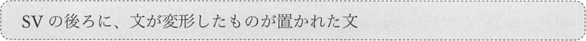

変形するということに注意してください。

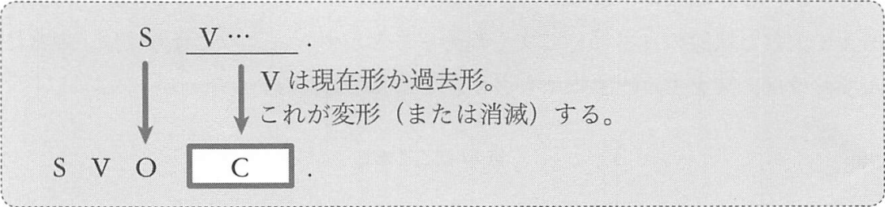

S は原則として変形しませんが、I, we, he, she, they の場合は、目的格の me, us, him, her, them に変形します。  
一方、V は変形します。但し、組み込まれる文が第2文型である場合は、V (be 動詞) は変形するのではなく、消えます。
また、組み込まれる文が受動態や進行形の場合も、be 動詞が消えます。  
上段の文が下段の文に組み込まれることにより、第5文型が完成するのですが、
V の変形、消滅の結果、C はいろいろな形になります。

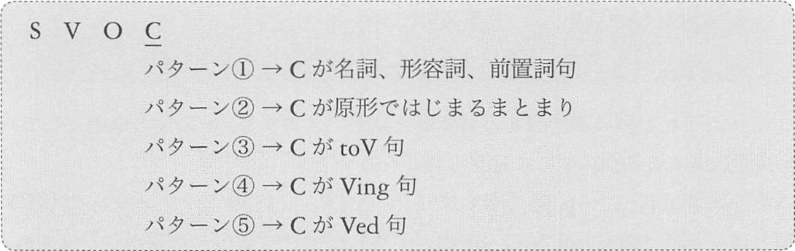

:point_right: 書いて覚える/暗記!

このうちパターン1が、以前に扱った第5文型です。(O = C が当てはまるのはパターン1のみです)

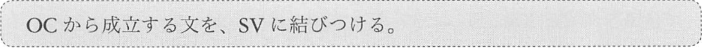

パターン 2~5 で用いられる動詞の代表例は次の通り

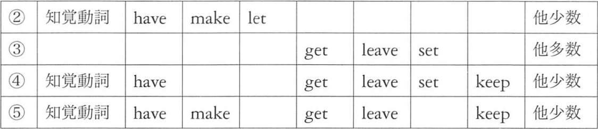

「知覚動詞」の代表例は、see, watch, hear, feel, sense, notice などです。
外界から体内に刺激、情報などを受け取るという意味を持つものです。

## <a id="E-0">E-0</a> SVOC の C としてはたらく、原形からはじまるまとまり
第5文型パターン2のイメージ図

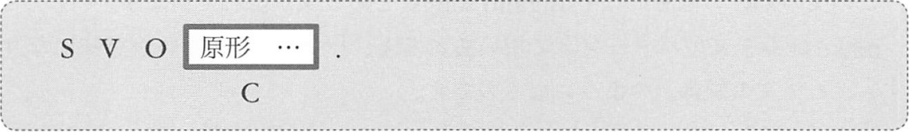

例: 知覚動詞の例1
```
I saw a girl swim across a river.
S V     O    ^^^^^^^^^^^^^^^^^^^
             C
(僕は少女が川を泳いで渡るのを見た)
> OC を文に戻すと
(A girl swam across a river)
```

例: 知覚動詞の例2
```
We didn't notice her leave the room.
S  v      V      O   ^^^^^^^^^^^^^^^
                     C
(我々は彼女が部屋をでるのに気づかなかった)
> OC を文に戻すと
(She left the room.)
```

例: 知覚動詞の例3
```
I heard Tom call my name.
S V     O   ^^^^^^^^^^^^
            C
(私はトムが私の名前を呼ぶのを聞いた)
> OC を文に戻すと
Tom called my name.
```

例: 他の動詞の例 make
```
My wife often makes me sing old songs.
S       動修  V     O  ^^^^^^^^^^^^^^
                       C
(妻はよく私に古い歌を歌わせる)
(I sing old songs)
```

例: 他の動詞の例 make
```
Those words will make you sound smart.
      S     v    V    O   ^^^^^^^^^^^
                          C
(これらの言葉を使えば、君には頭がいい人だという印象がつくだろう)
(You sound smart.)
この sound は「~のような印象である」という意味です
```

例: 他の動詞の例 let
```
Meg let her son read her dialy.
S   V       O   ^^^^^^^^^^^^^^
                C
(メグは息子に日記を読むのを許した)
(Her son read her dialy.)
let は「~させてやる」「許可する」という意味です
```

have を用いた場合の訳
- 自分が命令できる立場にいて、OCの状態を作り出した場合 → 「~させる」
- 依頼して OC の状態を作り出した場合 → 「~してもらう」
- 望んでもないのに OC の状況が生み出された場合 → 「~される」

例: have
```
The man had his son study physics.
    S   V       O   ^^^^^^^^^^^^^
                    C
(その男は息子に物理を勉強させた)
(His son studied physics.)
父親は息子に命令できる立場なので「させる」と訳す
```

```
I had my mother cut my hair.
S V      O      ^^^^^^^^^^^
                C
(私は母に髪を切ってもらった)
(My mother cut my hair.)
子どもが親に命令するのはおかしいのでここでは「してもらう」と訳す
```

```
I had John break my desk.
S V   O    ^^^^^^^^^^^^^
           C
(私はジョンに机を壊された)
(John broke my desk.)
なお、この状況は My desk was broken by John と表現したほうが
自然なものとなります
```

## <a id="E-1">E-1</a> SVOC の C としてはたらく toV 句
第5文型のパターン3です

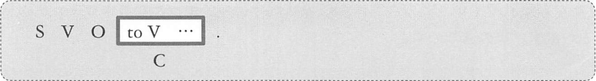

> ほとんどのものが「__なにかをするように促す__」という意味を持つ

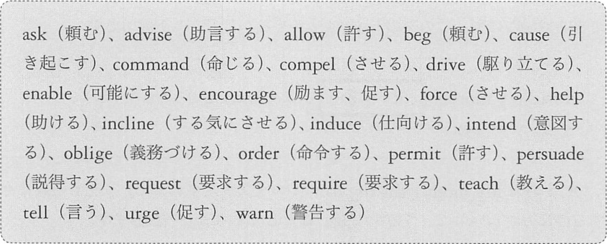

例:
```
Lisa told Bob to climb a tree.
S    V    O   ^^^^^^^^^^^^^^^
              C
(リサはボブに木に登るよう言った)
(Bob climbed a tree.)
```

```
You should encourage yourself to work hard.
S   v      V         O        ^^^^^^^^^^^^
                              C
(君は懸命に働くように自分にを促すべきだ)
(You work hard.)
```

```
We asked the teacher to speak slowly.
S  V         O       ^^^^^^^^^^^^^^^
                     C
(我々はその先生にゆっくりしゃべるよう頼んだ)
(The teacher spoke slowly.)
```

例: get
```
I got my mother to cut my hair.
S V      O      ^^^^^^^^^^^^^^
                C
(私は母に髪を切ってもらった)
(My mother cut my hair)
```
get は主に「(主に頼んで)~させる」「~してもらう」という意味です

例: set
```
Tom set his students to clean his room.
S   V       O        ^^^^^^^^^^^^^^^^^^
                     C
(トムは学生たちに自分の部屋を掃除させた)
(His students cleaned his room.)
```
set は「~させる」という意味です。

## <a id="E-2">E-2</a> SVOC の C としてはたらく Ving 句
第5文型のパターン4です。

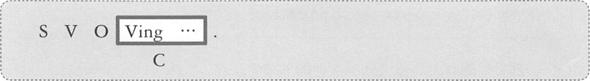

例: 知覚動詞
```
I saw a cat swimming seriously.
S V     O   ^^^^^^^^^^^^^^^^^^
            C
(私は猫が真剣に泳いでいるのを見た)
(A cat was swimming seriously.)
```

```
We heard a girl singing a song.
S  V       O    ^^^^^^^^^^^^^^
                C
(私たちは少女が歌を歌っているのを聞いた)
(A girl was singin a song)
```

```
I felt my heart beating wildly.
S V       O     ^^^^^^^^^^^^^^
                C
(私は心臓が激しく脈打っているのを感じた)
(My heart was beating wildly.)
```

上段の文が進行形である場合も be 動詞が消えます

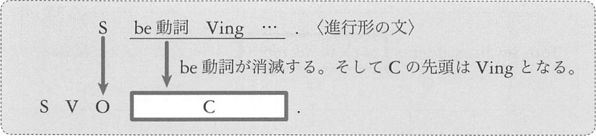

知覚動詞はパターン2でも用いられますが、パターン2では
「__出来事が完結するのを知覚した（見た、聞いたなど）__」というニュアンスになり、
パターン4では、OC の部分に埋め込まれている進行形の意味内容を反映して
「__出来事が起こっているその瞬間を知覚した__」という意味合いが強くなります

例: keep 「~している状態を保っておく」
```
We kept the fire burning.
S  V        O    ^^^^^^^
                 C
(我々は火が燃えたままにしておいた)
(The fire was burning.)
```

例: leave 「~している状態のまま放っておく」
```
Don't leave the engine running.
v     V         O      ^^^^^^^
                       C
(エンジンがかかったままにしておくな)
(The engine is running.)
```

## <a id="E-3">E-3</a> SVOC の C としてはたらく Ved 句
最後はパターン5です

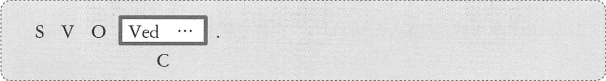

例: 知覚動詞
```
I saw a boy bitten by a dog.
S V     O   ^^^^^^^^^^^^^^^
            C
(私は少年が犬に噛まれるのを見た)
(A boy was bitten by a dog)
```

```
Did you hear your name announced?
v   S   V         O    ^^^^^^^^^
                       C
(君は名前がアナウンスされるのを聞いたか)
(Your name was announced.)
```

```
He felt himself insulted by the man.
S  V    O       ^^^^^^^^^^^^^^^^^^^
                C
(彼は自分がその男から侮辱されるのを感じた)
(He was insulted by the man)
```

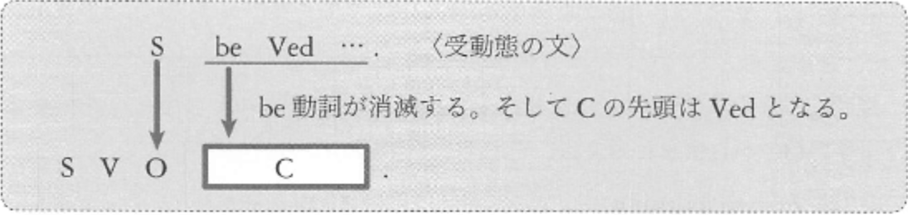

例: make 「O が C された状態を作り出す」
```
You should make your voice heard by the government.
S   v      V         O     ^^^^^^^^^^^^^^^^^^^^^^^
                           C
(君は政府に君の声を届けるべきだ)
(Your voice is heard by the government.)
```

例: keep 「保っておく」
```
Keep the door locked.
V        O    ^^^^^^
              C
(The door is locked.)
(ドアに鍵をかけておきなさい)
```

例: leave 「放っておく」
```
Bob left his car destroyed.
S   V        O   ^^^^^^^^^
                 C
(ボブは車が壊れたままにしておいた)
(His car was destroyed.)
```

have を用いた場合の訳
- 自分がその状態を作り出した場合 → 「~する」「~してしまう」
- 自分が命じて、他人がその状況を作り出した場合 → 「~させる」
- 依頼した場合 → 「~してもらう」
- 望んでもないのに OC の状況が生み出された場合 → 「~される」

例: get, have 「OC の状態を得る、持つ」
```
Tom got his watch mended by his father.
S   V       O     ^^^^^^^^^^^^^^^^^^^^
                  C
(トムは父親に時計を直してもらった) [依頼]
(His watch was meded by his father.)
```

```
I had my car broken.
S V      O   C

(私は車を壊された)　[望んでいない状況]
(My car was broken.)
```

```
Where did you have your hair cut?
      v   S   V          O   C
(どこで髪を切ってもらったの) [依頼]
(You hair was cut.)
```

```
I will have the work finished by ten.
S v    V        O    ^^^^^^^^^^^^^^^
                     C
(仕事を10までにしてしまうつもりだ) [自分が作り出した状況]
(The work will be finised by ten.)
```

```
He got the draft typed by his secretary.
S  V       O     ^^^^^^^^^^^^^^^^^^^^^^
                 C
(彼はその下書きを秘書にタイプさせた) [自分が命じた]
(The draft was typed by his secretary.)
```

