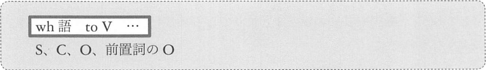
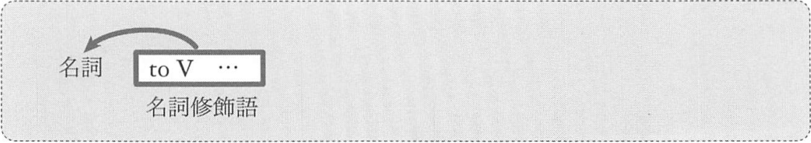
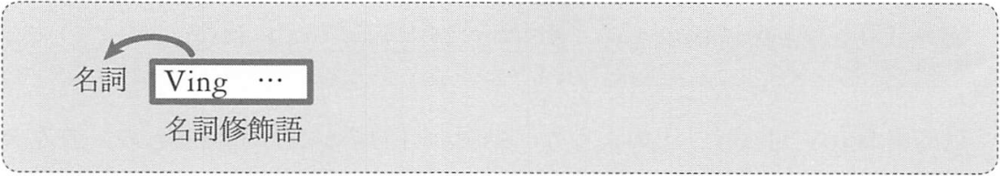
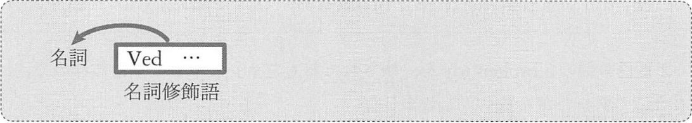

# 準動詞句の機能と意味


## 1. S, C, O 前置詞の O としてはたらく準動詞句
### <a id="A-1">A-1</a> S, C, O, 前置詞の O としてはたらく toV 句


このような、S, C, O, 前O としてはたらく toV 句は「__名詞的用法__」と呼ばれます。  
こと toV 句は、「~こと「~の」と訳します。

次のことを考えながら英文を読みます。
- それぞれの toV 句が S, C, O, 前O のどれとしてはたらいているか

例:
- __To work here without a helmet__ is dangerous.  
  <sup>(ここでヘルメットなしではたらくのは危険だ)</sup>
- __To protect the environment__ is important.  
  <sup>(環境を保護することは大切だ)</sup>
- Her wish is __to be a singer__.  
  <sup>(彼女の望みは歌手になることだ)</sup>
- My goal is __to win in the Olympics__.  
  <sup>(私の目標はオリンピックで勝つことだ)</sup>
- I have decided __to learn German__.  
  <sup>(私はドイツ語を学ぶことを決意した)</sup>
- They need __to take a rest__.  
  <sup>(彼らは休憩をとることを必要としている → 彼らは休憩をとる必要がある)</sup>
- We had no choice except __to accept his offer__.  
  <sup>(我々には彼の申し出を受け入れる以外の無の選択肢があった → 我々は彼の申し出を受け入れざるを得なかった)</sup>

「動詞 + to」のひとまとまりでとらえるしかない表現もあります。


例: 「動詞 + to」
- At last, we __came to__ understand his theory.  
  <sup>(ついに私たちは彼の理論を理解するようになった)</sup>
- How did you __get to__ own this picture?  
  <sup>(どのようにしてこの絵を所有するようになったのか)</sup>
- My son __appears to__ love animals.  
  <sup>(息子は動物が好きなようだ)</sup>
- The philosopher __seems to__ live in a barrel.  
  <sup>(その哲学者は樽の中に住んでいるようだ)</sup>
- I also __happend to__ be there on Christmas Eve.  
  <sup>(クリスマスイブには、私もたまたまそこにいた)</sup>

```
My son appears to love animals.
S      ^^^^^^^^^^ V    O
       v
```

toV 句の名詞的用法の形として、もう1つ、次のものを知ってください



この表現においては、to という語の中心の意味 (どこかに向かう「→」の意味。具体的には「意思」「義務」「予定」など) が
はっきりと存在します。よって、それを訳に反映させます。

例:
- I wonder __who to invite__.  
  <sup>(誰を招待するべきかということを思う → 誰を招待するべきだろうか)</sup>
- We couldn't decide __whether to go or stay__.  
  <sup>(我々は行くべきか留まるべきか決められなかった)</sup>
- I don't know __how to raise this animal__.  
  <sup>(この動物をどうやって育てるべきかわからない。)</sup>

全て「べき」という訳語で、義務のニュアンスを出しています。

### <a id="A-2">A-2</a> S, C, O, 前置詞のO としてはたらく Ving 句


この Ving 句も「~こと」「~の」という訳になります。
この Ving 句は「動名詞」と呼ばれます。

例:
- __Talking with this bird__ relaxies my mind.  
  <sup>(この鳥としゃべることが私の心を落ち着かせる → この鳥としゃべると心が落ち着く)</sup>
- __Reading in the dark__ dameges your eyes.  
  <sup>(暗いところで読書をすることが目に害を及ぼす → 暗いところで読書すると目が悪くなる)</sup>
- One of my bad habits is __biting pencils__.  
  <sup>(私の悪い癖の1つは鉛筆を噛むことだ)</sup>
- Your only fault is __speaking too fast__.  
  <sup>(君の唯一の欠点は速くしゃべりすぎることだ)</sup>
- My father often enjoys __playing tennis__.  
  <sup>(父はよくテニスをするのを楽しむ)</sup>
- Stop __sleeping in my room__.  
  <sup>(僕の部屋で寝るのはやめてくれ)</sup>
- Before __attacking a horse__, the tiger roared three times.  
  <sup>(馬を攻撃する前に、そのトラは3回吠えた)</sup>
- Meg left me without __saying good-bye__.  
  <sup>(メグはさよならも言わずに僕のもとを去った)</sup>

## 2. 名詞修飾語としてはたらく準動詞句
### <a id="B-1">B-1</a> 名詞修飾語としてはたらく toV 句



toV 句が名詞修飾語としてはたらく場合、後ろからの修飾となります。
形容詞説と同じです。この toV 句は「__形容詞的用法__」と呼ばれます。

形容詞的用法の toV 句には大きく分けて次の2があります。

1. 同格の that 節、関係副詞の that 節との関連で捉えるもの  
   <sup>(同格の toV 句、関係副詞の toV 句)</sup>
2. 関係代名詞との関連でとらえるもの  
   <sup>(主格の toV 句、目的格の toV 句)</sup>

#### 同格の that 節との関連でとらえるもの
名詞の中には「何が」は問題にならず、「どうする？」だけが問題になるものがあります。
「どうする？」という情報のみを述べたい場合は、その情報を toV 句にして名詞の後ろに置きます。

例:
- Tom made _a promise_ __to help me__.  
  <sup>(トムは私を助けてくれると約束した)</sup>
- Lisa has _a desire_ __to become a librarian__.  
  <sup>(リサには司書になりたいという願望がある)</sup>
- In Geneva, I didn't have _a chance_ __to use French__.  
  <sup>(ジュネーブではフランス語を使う機会はなかった)</sup>

このように、同格の that 節との関連でとらえるものを、ここでは「__同格の toV 句__」と呼びます。

#### 関係副詞の that 節との関連でとらえるもの
例:
- They need _a place_ __to practice judo__.  
  <sup>(彼らには柔道の稽古をする場所が必要だ)</sup>
- Can you find _time_ __to do this job__?  
  <sup>(この仕事をする時間は見つけられるか)</sup>
- I don't have any _reason_ __to stay here__.  
  <sup>(ここに留まるどんな理由もない)</sup>
- Tom knows _the way_ __to open this door__.  
  <sup>(トムはこのドアを開ける方法を知っている)</sup>

このように、関係副詞の that 節との関連でとらえるものを、ここでは「__関連副詞の toV 句__」と呼びます

#### 関係代名詞節との関連でとられるもの
文に助動詞が加わった場合は、直後の動詞が ing 形ではなく、to 不定詞形になるパターンもあるのです。

例: 主格の toV 句
- My wife __is__ _to make_ a speech at the party.  
  <sup>(妻はそのパーティでスピーチをする予定になっている)</sup>
- If you __are__ _to succeed_, you should read thid book.  
  <sup>(もし君が成功したいのなら、この本を読むべきだ)</sup>

最初の文では、助動詞 be が加わった結果、make が to make となっています。  
2番目の文では、助動詞 are が加わった結果、succeed が to succeed となっています。

この「助動詞 be + toV」は次のような意味になります。

> (1) 予定 (2) 意思 (3) 義務 (4) 可能 (5) 運命

主格の関係代名詞節に関しては、次の事実が存在します。

> 主格の関係代名詞節の述語が、__助動詞 be + toV__ である場合は、関係代名詞と be動詞を省略することができる

例: 関係代名詞と be 動詞を省略する
```
You are the man who is to lead this team.
                ^^^^^^^^^^^^^^^^^^^^^^^^
                関係代名詞 (whoが主格)

(関係代名詞と be 動詞を省略できる)
1) You are the man who is to lead this team.
2) You are the man        to lead this team.
```

例: 
- We need _a coach_ __to give us valuable advice__.  
  <sup>(我々には、貴重な助言をしてくれるコーチが必要だ)</sup>
- I must find _a man_ __to help me__.  
  <sup>(僕を助けてくれる人を見つけなくてはならない)</sup>

関係代名詞と be 動詞を復元してみると
```
We need a coach who is to give us valuable advice.
I must find a man who is to help me.
```

このように、主格の関係代名詞に相当する toV 句を、ここでは「__主格の toV 句__」と呼びます。

例: 目的格の関係代名詞に相当する toV 句
- We have _a report_ __to write__.  
  <sup>(私たちには書くべきレポートがある)</sup>
- I'll buy _a magazine_ __to read in the train__.  
  <sup>(電車の中で読む雑誌を買う)</sup>

これまでと違い toV 句の目的語がありません。  
最初の例 write にも、2番目の例 read にも目的語がありません。  
このような toV 句は、目的格の関係代名詞節に相当するものです。
これをここでは、「__目的格の toV 句__」と呼びます。

目的格の toV 句については、次のことに注意してください

> 主格の toV 句と同様に、目的格の toV 句にも「→」のニュアンス、
> 特に「義務」「意思」「可能」の意味があるので、これらの意味を読みとる

例: 上の例文を書き換える
```
   We have a report to write.
-> We have a report that[which] we should [must] write.
   I'll buy a magazine to read in the train.
-> I'll buy a magazine that[which] I will read in the train.
```

目的格に toV 句には、「動詞の目的語が欠けているもの」のみならず、
「前置詞の目的語が欠けているもの」もあります。

例: 前置詞の目的語が欠けている toV 句
- I must find _something_ __to sit on__.  
  <sup>何か座れるものを見つけなくちゃ</sup>
- I want _a case_ __to put this watch in__.  
  <sup>この時計を入れておく箱が欲しい</sup>

例: 関係代名詞節を用いて書き換える
```
   I must find something to sit on.
-> I must find something that[which] I can sit on.
   I want a case to put this watch in.
-> I want a case that[which] I can[will] put this watch in.
```

例: 目的格の toV 句を他にも
- He has _a large family_ __to support__.  
  <sup>(彼には養うべき大家族がいる)</sup>
- We have a lot of _probrem_ __to consider__.  
  <sup>(我々には考えるべきたくさんの問題がある)</sup>
- I must find _a girl_ __to dance with__.  
  <sup>(一緒に踊る女の子を見つけなくちゃ)</sup>
- We need _a man_ __to borrow money from__.  
  <sup>(我々はお金を借りられる人を必要としている)</sup>

### <a id="B-2">B-2</a> 名詞修飾語としてはたらく Ving 句



> 主格の関係代名詞節の内部が__進行形__である場合は、関係代名詞と be 動詞を省略することができる

例: 省略の例
```
The lady who is dancing on the stage is my wife.
         ^^^^^^^^^^^^^^^^^^^^^^^^^^^
         関係代名詞(主格が who)

1) The lady who is dancing on the stage is my wife.
2) The lady        dancing on the stage is my wife.
```
(1) では関係代名詞の who がまとまりを作っていますが (2) では関係代名詞が存在しないため、
dancing が名詞修飾語のまとまりを作っています

例: 類例
- Do you know the name of _the boy_ __talking with Jack__?  
  <sup>(ジャックと話している男の子の名前を知っているか)</sup>
- _The ship_ __burning on the river__ is mine.  
  <sup>(川の上で燃えている船は僕のものだ)</sup>

なお、ing 形の動詞が、前から名詞を修飾する場合もあります

例: ing 形の動詞が前から名詞を修飾する
- I painted a picture of _a_ __running__ _dog_.  
  <sup>(私は走っている犬の絵を描いた)</sup>
- My wife touched _a_ __sleeping__ _tiger_.  
  <sup>(妻は寝ているトラに触った)</sup>

### <a id="B-3">B-3</a> 名詞修飾語としてはたらく Ved 句



この Ved 句は、__過去分詞形からはじまる__まとまりです。

> 主格の関係代名詞節の内容が__受動態__である場合は、関係代名詞と be 動詞を省略することができる

例: 省略の例
```
This is a symphony which was composed by Mozart.
                   ^^^^^^^^^^^^^^^^^^^^^^^^^^^^
                   関係代名詞
1) This is a symphony which was composed by Mozart.
2) This is a symphony           composed by Mozart.
```
(1) では、関係代名詞の which が名詞修飾語としてはたらくまとまりを作っていますが、
(2) では過去分詞形の動詞 compsed がまとめ役を担っています。

例: 類例
- What is _the language_ __spoken in your country__?  
  <sup>(あなたの国で話されている言語は何か)</sup>
  <sup>(What is the language that[which] is spoken your country.)</sup>
- I have _a picture_ __painted by Turner__.  
  <sup>(私はターナーによって描かれた絵を持っている)</sup>
  <sup>(I have a picture that[which] was painted by Turner)</sup>

類: 前からの修飾
- Don't read _the_ __opend__ _letter_.  
  <sup>(その開封された手紙は読むな)</sup>
- My son was playing with _a_ __broken__ _toy_.  
  <sup>(息子は壊れたおもちゃで遊んでいた)</sup>

