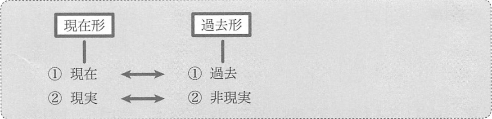

# 基本形
助動詞が存在しない文を、「基本形」と呼ぶのでした。

1. 述語の先頭が現在形の文
2. 述語の先頭が過去形の文

## 1. 述語の先頭が現在形の文
例:
- My mother was thin when she was young. but she __is__ heavy now.  
  (母は若い頃痩せていたが、今は太っている)
- I __remember__ his name now. but someday I will forget it.  
  (今は彼の名前を覚えているが、いつかは忘れるだろう)

現在形には、特に「現在」という意味を持たない例も数多くあります。

例:
- We __live__ in Shimane Prefecture.  
  (我々は島根県に住んでいる)
- I __study__ French before breakfast every day.  
  (私は毎日、朝食の前にフランス語を勉強する)
- Light __travels__ fast.
  (光は高速で進む)

これらの文の内容は、特に現在に限った話ではありません。
「現在」というよりも「現実」、あるいは「事実」「真実」を述べる用法です。
こちらの用例のほうが多いと言えます。

現在形に関する他の用法として、新聞や雑誌の見出しが挙げられます。
過去の出来事述べる際に、現在形が用いられるのです。

- Japan __blasts__ U.S. trade policy.  
  (日本、米国の通商政策を避難)
- Bush __sights__ orders to streamline bureaucracy.  
  (ブッシュ大統領、官僚合理化命令に署名)  
  「同格の toV」

## 2. 述語の先頭が過去形の文
- We __went__ to Warsaw last year.  
  (私たちは去年ワルシャワに行った)
- My wife __was__ bitten by a coyote yesterday.  
  (妻は昨日コヨーテに噛まれた)

過去の1点について述べるのではなく、過去の繰り返しの出来事や、時間の幅を持つことについて述べる場合があります。
- I _often_ __ate__ pasta when I lived in Milan.  
  (ミラノに住んでいた時、よくパスタを食べた)
- We __owned__ a cruiser _for five year_.   
  (我々は5年間クルーザーを所有した)

現在形には「現在」に加えて、「現実」を表す用法もありましたが、過去形には「過去」に加えて、
「非現実」、あるいは「現実味の低さ」を表す用法があります。
- Mr. White, I __wanted__ to confess something to you.  
  (ホワイトさん、私はあなたに打ち明けたいことがございます)  
  この wanted は「望んだ」という過去の意味ではなく、現在形の want ではダイレクトすぎて、失礼であると判断し、過去形の wanted を用いることによって現実味を減らし、結果として丁寧なニュアンスとなっています。

:point_right: しっかりと頭に頭に入れる
