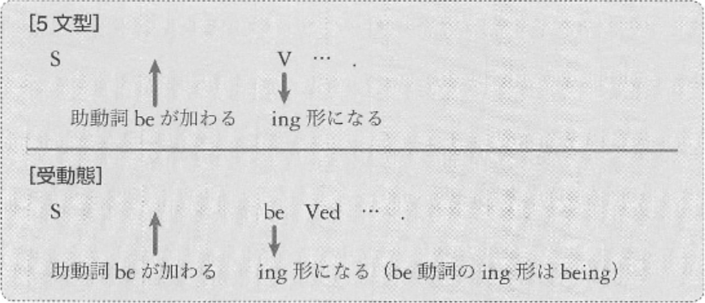
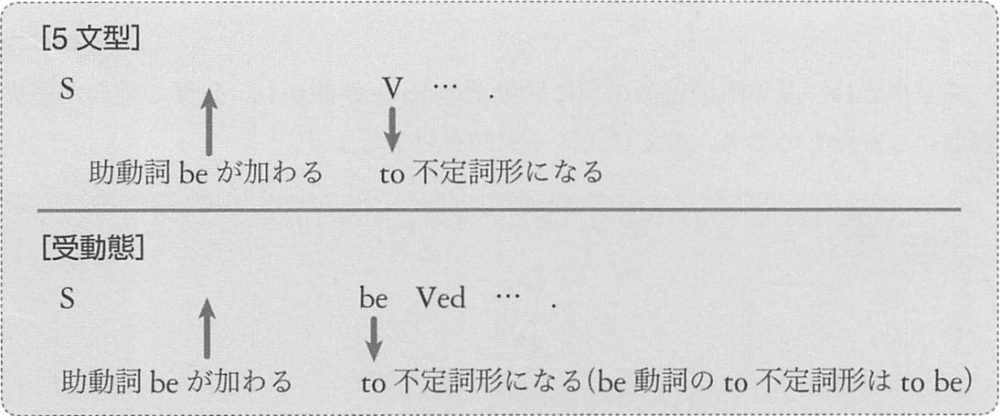

# 進行形

:point_right: 受動態の文が進行形になったものは慣れるまでに時間がかかる  
:point_right: 進行形には「予定」「意思」の意味がある

## 1. 現在進行形

例:
- Meg __is__ sleeping now.  
  (メグは今、寝ている)
- Your grandmother __is__ _chasing_ a beautiful butterfly.  
  (君のおばあちゃんがきれいなチョウチョを追いかけている)
- My Ship __is__ _being_ painted now.  
  (僕の船が今、塗装されている)

例: 「予定」「意思」の意味
- We __are__ _visiting_ Thailand next week.  
  (我々は来週、タイを訪れる予定だ)
- I __am__ _meeting_ Meg tonight.  
  (今晩メグに会う予定だ)
- I'__m__ _going_ home.  
  (家に帰ろう)

## 2. 過去進行形
過去進行形にも、現在進行形と同じように「進行」の意味と、「予定」「意志」の意味があります。

例: 「進行」
- At the moment of the earthquake, I __was__ _dancing_ on the stage.  
  (その地震の瞬間、僕はステージの上で踊っていた)
- While I __was__ _sleeping_, my wife sold my watch to Tom.  
  (僕が寝ている間に、妻はトムに僕の時計を売った)
- When you rang the bell, I __was__ _being_ scolded by my father.  
  (君がベルを鳴らした時、僕は親父に怒られていた)

例: 「予定」「意志」
- We __were__ _visiging_ the company the next day.  
  (我々は翌日、その会社を訪問する予定だった)
- I __was__ _quitting_ my job the next week.  
  (私は翌週、仕事を辞めるつもりだった)

## 3. 準動詞句への変化
進行形の文を toV 句にすると、「to be ing形」という形になるのです。

:point_right: 進行形の文が準動詞句になった toV 句 / ing 句は使いこなせる人が非常に少ない  
:point_right: このセクションの例文は暗記!

例: toV 句
- Tom often pretends __to be working hard__.  
  (トムは、しばしば懸命に働いているふりをする)
- When my mother came home, I pretended __to be cleaning my room__.  
  (母が帰宅した時、私は部屋の掃除をしているふりをした)

注意しなくてはならないのは、この「to be ing 形」は、現在進行形に相当するものもあれば、
過去進行形に相当するものもあるということです。
述語動詞の形から、どちらなのかを判断します。

## 4. be to 不定詞
基本形の文に助動詞 be が加わった場合は、直後の動詞が ing 形になる進行形だけでなく、
to 不定詞形になるものもあります。

この表現は、「義務」「意志」「予定」「可能」「運命」などの意味を表します。

例:
- I __am__ _to meet_ Meg at 5p.m. tomorrow.  
  (私は、明日の午後5時にメグに会う予定になっている) [予定]
- What __am I__ _to do_ next?  
  (私は次に何をするべきだろうか) [義務]
- You should start training now, if you __are__ _to win_ the game.  
  (もしその試合に勝ちたいなら、もうトレーニングをはじめたほうがいい) [意志]
- The star __is__ _to be_ seen early in the morning.  
  (その星は、夕方の早い時間に見られる) [可能]
- Ted __was__ not _to return_ to his hometown.  
  (テッドは故郷に戻らない運命にあった) [運命]

