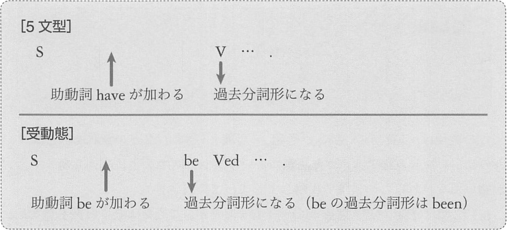

# 完了形
完了形とは、基本形の述語の前に助動詞の have が置かれ、先頭の述語が過去分詞形になったものです。

## 1. 現在完了形
- 動作動詞 - walk, swim, kick - 動きを表すもの
- 状態変化動詞 - open, melt, stop - 状態の変化を表すもの
- 状態動詞 - know, have - 状態を表すもの
- 出来事動詞 - 動作動詞と状態変化動詞をまとめたもの

例: 現在完了形
- My father __has__ _mented_ my watch.  
  (父が僕の時計を修理した)
- The snow __has__ _stopped__.  
  (雪が降り止んだ)

