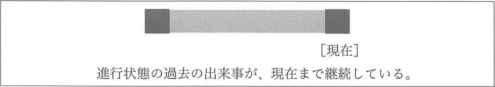

# 完了形
完了形とは、基本形の述語の前に助動詞の have が置かれ、先頭の述語が過去分詞形になったものです。


## 1. 現在完了形
- __動作動詞__ - walk, swim, kick - 動きを表すもの
- __状態変化動詞__ - open, melt, stop - 状態の変化を表すもの
- __状態動詞__ - know, have - 状態を表すもの
- __出来事動詞__ - 動作動詞と状態変化動詞をまとめたもの

### 出来事動詞
出来事動詞の場合、「過去の出来事の結果、現在、何らかの事態が存在する」という意味になります。

例: 現在完了形 - 出来事動詞「結果」
- My father __has__ _mented_ my watch.  
  <sup>(父が僕の時計を修理した)</sup>
- The snow __has__ _stopped__.  
  <sup>(雪が降り止んだ)</sup>

例: 現在完了形 - 出来事動詞「完了」
- Tom __has__ already _posted_ the letter.  
  <sup>(トムはすでにその手紙を投函した)</sup>
- We __have__ just _solved_ the problem.  
  <sup>(我々はちょうどその問題を解決したところだ)</sup>

それぞれ、「投函は完了した」「問題は解決した」という意味が感じられます。

例: 現在完了形 - 出来事動詞「経験」
- My wife __has__ _caught_ a mole twice.  
  <sup>(妻はモグラを2回捕獲したことがある)</sup>
- I __have__ _eaten_ frogs several times.  
  <sup>(カエルを食べたことが数回ある)</sup>
- __Have__ you ever _traveled_ by plane?  
  <sup>(今まで、飛行機で旅行したことがあるかい)</sup>

> 文中に次のような言葉がある場合は、__経験__の意味が感じられます。  
> ever (&lt;疑問文で&gt; かつて)、never (一度も ~ ない)、once (一度、かつて)、  
> twice (2回)、~ times (~回)

以上のことから、出来事動詞が用いられた現在完了形の意味は、次のようにまとめられます。

> 結果 (+ 完了/経験)

これは次のことを意味します。

> 過去の出来事の結果、現在、何らかの事態が存在する。  
> そして、その事態は、__完了__または__経験__と表現できる場合がある。

### 状態動詞
動詞が状態動詞の場合は、「過去の状態を、現在も have している」ということで、
「過去の状態が現在まで続いている」という「継続」の意味になります。

例: 現在完了形 - 状態動詞「継続」
- My brother __has__ _been_ in Canada for ten years.  
  <sup>(兄貴は10年間カナダにいる)</sup>
- My son __has__ _been_ sick since yesterday.  
  <sup>(息子は昨日から病気だ)</sup>
- We __have__ known each other since we were young.  
  <sup>(我々は、若かった頃からお互いを知っている)</sup>
- How long __have__ you _lived_ in Japan?  
  <sup>(どれくらい日本に住んでいるの)</sup>

継続の意味の場合、期間の長さや、始点が示されることが多いものです。
期間は「for ~」で示され、始点は「since ~」で示されるのが一般的です。  
<sup>(since は前置詞であり、従位接続詞でもあるので、後ろに名詞が置かれることも、SV が置かれることもあります)</sup>


完了形の意味はあくまでも「__結果__」か「__継続__」です。
「__完了__」と「__経験__」はあくまでもオプションにすぎないのです。

## 2. 現在完了進行形
「できごとの継続」とは次のようなものです。
- トムは2時間走り続けている
- その機械は昨晩から動き続けている

これらは「__現在完了進行形__」と呼ばれる形によって表されます。
現在完了進行形とは「S has[have] been Ving」という連なりの表現です。

例: 現在完了進行形
- Tom __has been running__ for two hours.  
  <sup>(トムは2時間走り続けている)</sup>
- The machine __has been working__ since last night.  
  <sup>(その機械は昨晩から動き続けている)</sup>
- How long __have__ you __been watching__ TV?  
  <sup>(どれくらいの間、テレビを見続けているのか)</sup>



> 進行状態の過去の出来事が、現在まで継続している

## 3. 過去完了形
過去完了形とは、助動詞 have が過去形の had で用いられる完了形です。


左の図は「過去のある時点を基準にして、それ以前の出来事の結果が、その基準時に及んでいる。そして何らかの事態が存在する」という状況を表します。  
一方、右の図は「過去のある時点を基準にして、それ以前の状態が、その基準時まで継続している」という状況を表します。

例: 
- When I arrived at the hall, the concert __had__ already _started_.  
  <sup>(私がホールに着いた時には、コンサートはすでに始まっていた) [結果]</sup>
- I __had__ never _talked_ with Lisa until Bob held the party.  
  <sup>(ボブがそのパーティを開くまで、私はリサと話したことは一度もなかった) [結果]</sup>
- Yesterday, I took my son to Tokyo Dome, as he __had__ long _wanted_ to visit it.  
  <sup>(息子が長いこと行きたがっていたので、昨日私は彼を東京ドームに連れて行ってやった) [完了]</sup>

## 4. 過去完了進行形
「現在完了進行形」のみならず、「過去完了進行形」というものもあります。  
過去完了進行形は、[S had been Ving」です。

例:
- I __had been wating__ for thirty minutes before the bus came.  
  <sup>(バスが来るまでに私は30分間待ち続けていた)</sup>
- Everything was white because it __had been snowing__ for two days.  
  <sup>(2日間雪が降り続いたので、すべて真っ白だった)</sup>


## 5. 大過去
- I knew that Meg had loved Ken.  
  <sup>(私はメグが(それ以前に) ケンを好きだったことを知っていた)</sup>
- On the day before the exam, Lisa gave her son a pen that she __had__ _used_ when she was young.  
  <sup>(その試験の前日に、リサは若い頃に使っていたペンを息子にあげた)</sup>

```
[過去完了形]
1. 現在完了形が過去に移動したもの
   → 「結果 (+ 完了/経験)」「継続」の意味を持つ
2. 大過去
   → 「過去の時点からさらに過去へのズレ」を表す
```

## 6. 準動詞句への変化
完了形の文も toV 句になります。また Ving 句にもなります。

```
完了形の文が toV 句になったもの
 to have V (過去分詞形)
完了形の文が Ving 句になったもの
 having V (過去分詞形)
```
注意しなくてはならないのは、いずれにおいても、現在完了形に相当するものと、過去完了に相当するものがあるということです。

例: toV 句
- I am satisfied __to have finished the task smoothly__.  
  <sup>(その仕事を円滑に終えて満足している)</sup>
- My wife pretended __to have seen the movie several times__.  
  <sup>(妻はその映画を何回か観たことがあるかのようにふるまった)</sup>

例: Ving 句
- __Having visited the city twice__, I know the beauty of it.  
  <sup>(2度訪れたことがあり、その都市の美しさを知っている)</sup>
- __Having visited the city twict__, I knew the beauty of it.  
  <sup>(2度訪れたことがあり、その都市の美しさを知っていた)</sup>

```
[to have V (過去分詞形)、having V (過去分詞形)]
1. 現在完了に相当するもの
2. 過去完了に相当するもの
```

例: toV 句 - 大過去
- At the party, Lisa pretended __to have lived in Paris when she was young__.  
  <sup>(そのパーティで、リサは若い頃パリに住んでいたふりをした)</sup>
- My son appeared __to have stayed at Meg's house on the previous night__.  
  <sup>(息子は前の晩、メグの家に滞在していたようだった)</sup>

例: toV 句 - 現在から過去へのズレ
- My husband often pretends __to have poor when he was a university student__.  
  <sup>(夫はよく、大学生時代に貧乏だったふるをする)</sup>

例: having 過去分詞形
- This morning, my husband admitted __having met Meg last night__.  
  <sup>(今朝、夫は昨日の夜メグと会ったことを認めた)</sup>
- You should admit __having been with Lisa when I called you__.  
  <sup>(あなたは、私が電話した時にリサと一緒にいたことを認めるべきだ)</sup>

```
[to have V (過去分詞形)、having V (過去分詞形)]
1. 現在完了に相当するもの
2. 過去完了に相当するもの (= 「本来の過去完了」に相当するもの)
3. 過去へのズレを表すもの
   * 大過去に類するものだが、大過去とは異なり「現在から過去へのズレ」をも表す
```


