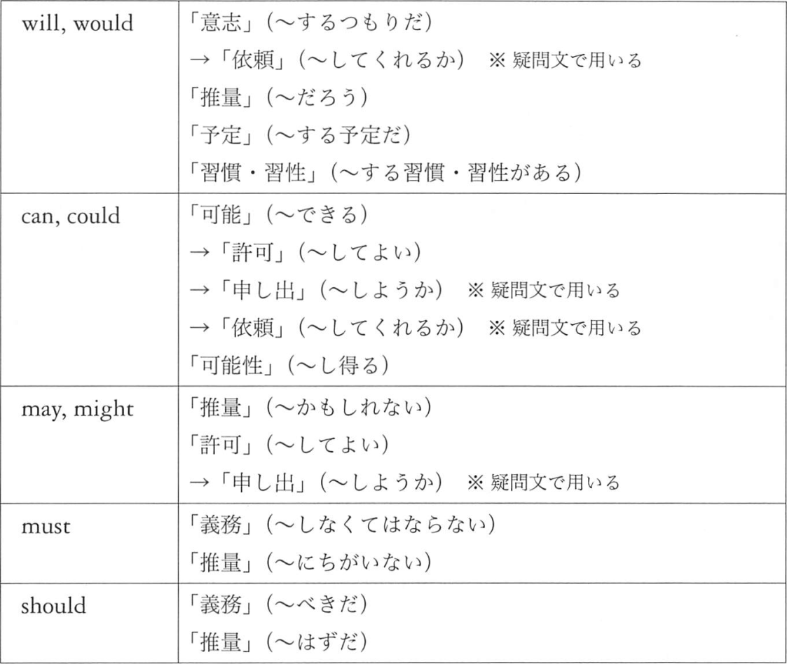
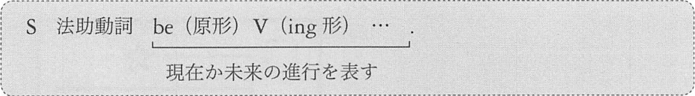
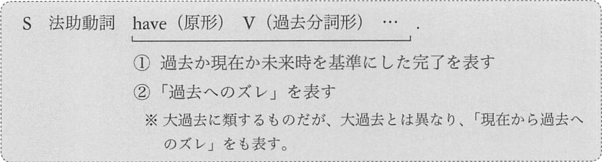

# 法助動詞

1. [各法助動詞の意味](#各法助動詞の意味)
2. [過去の文脈で用いられる過去形の法助動詞](#過去形の法助動詞)
3. [他の法助動詞、法助動詞に相当する表現](#他の法助動詞)
4. [法助動詞 + 進行形](#法助動詞進行形)
5. [法助動詞 + 完了形](#法助動詞完了形)

## 1. 各法助動詞の意味
will, would, can, could, may, might, must, should

will, would の意味は 「意志」「推量」「予定」「習慣、習性」です。

例: will, would 「意志」(~するつもりだ)
- __I will__ _send_ this watch to Tom.  
  (この時計をトムに送るつもりだ)
- __I will__ _go_, whatever you say.  
  (君が何を言おうと、僕は行くよ)

例: will, would 「推量」(~だろう)
- I think that he __will__ _be_ a Japanese.  
  (私は彼は日本人だろうと思う)
- That __would__ _be_ a wolf.  
  (あれはオオカミだろう)

例: will, would 「予定」(~する予定だ)
- __I will__ _be_ in Bern tomorrow.  
  (明日はベルンにいる予定だ)
- __Will__ you _be_ free tonight?  
  (今晩は暇ですか)

例: will, would 「習慣・習性」(~する習慣・習性がある)
- Tom __will__ often _watch_ TV all night.  
  (トムはよく一晩中テレビを観る)
- My father __will__ _smoke_ after supper.  
  (父は夕食の後、タバコを吸う)

例: will, would 「依頼」(相手の意志を尋ねるところからの発展として)
- __Will__ you _lend_ me this pen?  
  (君はこのペンを僕に貸す意志があるか → このペンを貸してくれるか)
- __Would__ you _give_ me this note?  
  (君はこのメモを私に与える意志はありますか → このメモを頂けますか)

can, could の意味は「可能」「可能性」です。
例: can, could 「可能」(~できる) 「可能性」(~し得る)
- this animal __can__ _sleep_ in the water.  
  (この動物は水中で眠ることができる)
- __Can__ you _speak_ Bengali?  
  (ベンガル語がしゃべれるか)
- Where __can__ my watch _be_?  
  (僕の時計はどこにあり得るか)
- His story __can't__ _be_ true.  
  (彼の話は本当ではあり得ない)

断定するのではなく、控えめに「可能だろう」「可能性があるだろう」と述べる
場合は could を用います。

例: could 「推量」
- Meg __could__ _solve_ this problem now.  
  (今やメグはこの問題を解けるだろう)
- I think that it __could__ _be_ true.  
  (私はそれは本当のことであり得ると思う)

例: could 「許可」(「可能」からの発展として)
- You __can__ _use_ my car.  
  (僕の車を使ってもいいよ)
- __Can__ I _go_?  
  (行っていいかな)
- __Could__ I _go_?  
  (行っていいでしょうか)

例: can, could 「申し出」(~しましょうか) 「依頼」(~してくれるか)
- __Can__ I _help_ you?  
  (私は君を助けることが可能か → なにか力になろうか)
- __Can__ you _open_ the door?  
  (ドアを開けることが可能か → ドアを開けてくれるか)
- __Could__ you _sing_ this song?  
  (この歌を歌うことが可能ですか → この歌を歌っていただけますか)

may, might の意味は、「推量」「許可」です。

例: may, might 「推量」(~かもしれない)
- It __may__ _rain_ tomorrow.  
  (明日雨が降るかもしれない)
- We __may__ _discover_ the treasure someday.  
  (我々はいつかその宝を発見するかもしれない)
- It __might__ _rain_ tomorrow.  
  (明日雨が降るかもしれない)
- His shop __might__ _be_ closed now.  
  (彼の店は今はもう閉まっているかもしれない)

例: may, might 「許可」(~してよい)
- You __may__ _leave_ the room.  
  (退室してよい)
- __May__ I _see_ you for a few minutes?  
  (2,3分会えますか)
- __Might__ I _see_ you for a few minutes?  
  (2,3分お会いできますか)

例: may, might 「許可」は「申し出」の意味に発展します
- __May__ I _help_ you?  
  (私にあなたを助けさせてもらえるか → 何かしようか)
- __Might__ I _help_ you?  
  (私にあなたをたすけさせてもらえますか → 何かいたしましょうか)

次は must です。must の意味は、「義務」「推量」

例: must 「義務」(~しなくてはならない) 「推量」(~にちがいない)
- You __must__ _meet_ Meg.  
  (君はメグに会わなければならない)
- You __must__ not _use_ my car.  
  (君は僕の車を使ってはならない) [禁止の意味]
- His wife __must__ _be_ a witch.  
  (彼の奥さまは魔女に違いない)

最後は should です。should の意味は、「義務」「推量」です。

例: should 「義務」(~べきだ) 「推量」(~はずだ)
- You __should__ _obey_ your parents.  
  (ご両親に従うべきだ)
- You __should__ _go_ to the new hotel.  
  (その新しいホテルに行ってみてごらん)
- You __shouldn't__ _dance_ here.  
  (ここで踊るべきではない)
- Meg __should__ _be_ home now.  
  (メグは今は家にいるはずだ)
- He __should__ _arrive_ there by noon.  
  (彼は正午までにそこに着くはずだ)

should は「義務」よりも、より軽い「勧誘」とも言える意味で用いられることも
非常に多いものです。2番目がその例です。

## 2. 過去の文脈で用いられる過去形の法助動詞
過去について語っている文脈の中で用いられた法助動詞の過去形は、意味が何であれ、
単に「過去だ」ということを表します。

例:
- I thought that Lisa __would__ _be_ a Canadian.  
  (僕はリサはカナダ人だと思った)
- My father told me that the man __might__ _be_ a spy.  
  (父は私にその男はスパイかもしれないと言った)

主節の動詞が過去形のため、従属節の法助動詞も過去形を用いているというだけのことで、
「丁寧・控えめ」とはなんの関係もありません。

例: 過去形の法助動詞が主節部分にある例
- When we were students, we __would__ often _sing_ for hours.  
  (我々が学生だった頃は、しばしば何時間も歌ったものだった)
- I __could__ _play_ the violin when I was a child.  
  (私は子どもの頃はバイオリンを弾くことができた)
- We __couldn't__ _open_ the door, however hard we tried.  
  (どんなに一生懸命に挑戦しても、我々にはそのドアを開けられなかった)

例: SV どうしが等位接続詞によって結ばれている例
- I told him to go to the park, but he __wouldn't__  _leave_ his room.  
  (私は彼に公園に行くように言ったが、彼は自室を出ようとしなかった)

## 3. 他の法助動詞、法助動詞に相当する表現
扱っていない法助動詞の代表例として shall, ought, had better の3つが挙げられます。  
また、法助動詞に類する表現である have to と used to についてもここで扱います。

例: shall (「Shall I ~」 ~しましょうか, 「Shall we ~」 ~しませんか)
- __Shall__ I _open_ the door?  
  (ドアを開けましょうか)
- __Shall__ we _swim_ here?
  (ここで泳ぎませんか)

例: shall 「意志」を表す例(will よりも強い意志を表します)
- I __shall__ _return_.  
  (私は戻ってくる)
- I __shall__ _marry_ you.  
  (お前と結婚するつもりだ)

例: ought「義務」(~べきだ) 「推量」(~はずだ)
> 直後の V が、原形でなく、to 不定詞形になる

- You __ought__ _to obey_ the rule.  
  (君はその規則に従うべきだ)
- John __ought__ _to be_ punished.  
  (ジョンは罰せられるべきだ)
- Meg __ought__ _to know_ that.  
  (メグはそのことを知っているはずだ)

例: ought を用いた否定文、疑問文
- You __ought__ not _to leave_ here.  
  (きみはここを去るべきではない)
- __Ought__ I _to go_ there?
  (私はそこに行くべきか)

had better (~したほうがよい) です。had better の基本用法として「特定の状況下で
何をすべきか(最善の行動方針)について、意見を述べるために使われます」

例: had better
- You __had better__ _write_ a letter to Bob.  
  (ボブに手紙を書いたほうがよい)
- We __had better__ _go_.  
  (行ったほうがいい)

例: had better の否定文
- You __had better__ not _use_ this pen.  
  (このペンは使わないほうがいい)

例: have to (had to) (~しなくてはならない)
- You __have to__ _read_ this book.  
  (君はこの本を読まねばならない)
- Lisa __has to__ _meet_ Bob.  
  (リサはボブに会わなくてはならない)
- I __had to__ _read_ the book twice.  
  (私はその本を2回読まねばならなかった)
- We __had to__ _stay_ there.  
  (我々はそこに滞在しなくてはならなかった)

例: have to の疑問文
- __Do__ we __have to__ _buy_ a hat?  
  (我々は帽子を買わなくてはならないか)
- __Does__ she __have to__ _quit_ her job?  
  (彼女は仕事を辞めなくてはならないのだろうか)
- __Did__ I __have to__ _go_ there?  
  (私はそこに行かなければならなかったのか)

例: have to の否定文
- You __don't__ have to _cook_.  
  (君は料理をする必要はない)
- Your son __doesn't have to__ _come_ here.  
  (息子さんがここに来る必要はない)
- You __didn't have to__ _sing_.  
  (君が歌う必要はなかった)

have to は、形の上では法助動詞と違いがあるので、正式な法助動詞ではなく、
「__法助動詞相当表現__」だといえます。

否定文の意味に注意する必要があります。
must (~しなくてはならない) の否定形は、「~してはならない」という「__禁止__」の意味
でしたが、have to の否定形は「~する必要はない」という「__不必要__」の意味になります。

## 4. 法助動詞 + 進行形
ここまでの法助動詞はすべて、基本形に加わっていました。
法助動詞は、進行形に加わることもあります。

例: 法助動詞 + 進行形
- Tom __would__ _be sleeping_ now.  
  (トムは今眠っているだろう)
- My husband __can't__ _be swimming_ now.  
  (夫が今、泳いでいるはずがない)

例: 未来の事柄について述べる例
- Lisa __would__ _be singing_ with me about this time tommorow.  
  (明日の今頃、リサは僕と歌っているだろう)
- Meg __may__ _be staying_ at this hotel tonight.  
  (今晩メグは、このホテルに滞在しているかもしれない)

## 5. 法助動詞 + 完了形
法助動詞は完了形にも加わります。この場合も、法助動詞の後ろの部分の基準時は、現在である場合と、未来の時点である場合があります。

例: 基準時が現在 - 法助動詞で推量を加えています
- My son __may__ _have read_ this book several times.  
  (息子はこの本を何回か読んだことがあるかもしれない) [結果 + 経験]
- Tom __should__ _have finished_ the work now.  
  (トムは、今はその仕事を終えているはずだ) [結果 + 完了]
- Meg __must__ _have been_ happy since she came here.  
  (メグはここに来て以来、ずっと幸せにちがいない) [継続]

例: 基準時が未来
- They __would__ _have finished_ this work by the end of this week.  
  (今週末までには、彼らはこの仕事を終えているだろう)

例:
- When I called Meg, she __may__ _have_ already _read_ my letter.  
  (私がメグに電話をした時には、彼女はすでに私の手紙を読んでいたのかもしれない)

例:
- She __would__ _have been_ busy until you helped her.  
  (君が彼女を助けるまで、彼女はずっと忙しかったのだろう)

以上からわかることは、法助動詞の後ろの完了形は、現在完了に相当する場合と、
未来の時点の完了形に相当する場合と、過去完了に相当する場合の3通りがあるということです。

例: 大過去と同様の昨日を持つ場合
- As I talked with Tom three days ago, I thought that he __would__ _have used_ my bicycle on the previous day.  
  (私は3日前にトムと話していて、その前の日に彼が私の自転車を使ったのだと思った)

例: 法助動詞 + 完了形 - 現在から過去へのズレ
- It __must__ _have rained_ yesterday.  
  (昨日、雨が降ったにちがいない)
- You __shouldn't__ _have delivered_ a speech at the party.  
  (そのパーティで、君はスピーチをするべきじゃなかった)
- Tom __can't__ _have called_ you last night.  
  (昨日の夜、トムが君に電話をしたはずがない)
- Bob __ought__ _to have met_ Meg here last week.  
  (ボブは先週、ここでメグと会ったはずだ)

全て現在の時点から、過去のことを推量しています。
これらの完了形は「過去の出来事の結果を受けて、現在、何らかの事態が存在する」という意味はありません。
「現在から過去へのズレ」を表すための完了形なのです。

> 過去のことに対して推量する場合は、「__法助動詞 + have + 過去分詞形__」という形を用いる  
> この知識は、「仮定法」で生きてくることになります

